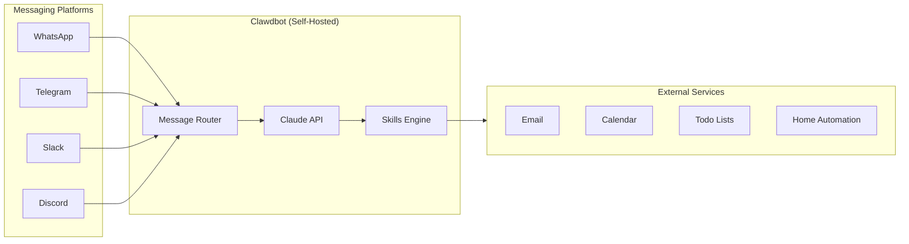

## Summary

Clawdbot brings Claude to your messaging apps. Instead of using a web interface, you interact with Claude through WhatsApp, Telegram, Slack, Discord, Teams, Signal, or iMessage. The tool runs on your own devices, giving you control over your data while enabling agentic workflows.

## Key Features

- **Multi-platform messaging** — Chat with Claude through any major messaging app
- **Self-hosted** — Runs on your devices, not in the cloud
- **Extensible skills** — Build custom automations through an open architecture
- **Service integrations** — Connects to email, calendars, todo lists, JIRA, Linear, and home automation
- **Agentic workflows** — Email management, meeting prep, scheduled briefings
- **Claude Code integration** — Run autonomous Claude Code loops from messaging apps

## Architecture



::

## Installation

Requires Node.js 22+ or Bun:

```bash
npm install -g clawdbot
# or clone and build from source
```

## Connections

- [[claude-code-skills]] — Both use extensible skill systems to teach Claude specialized workflows
