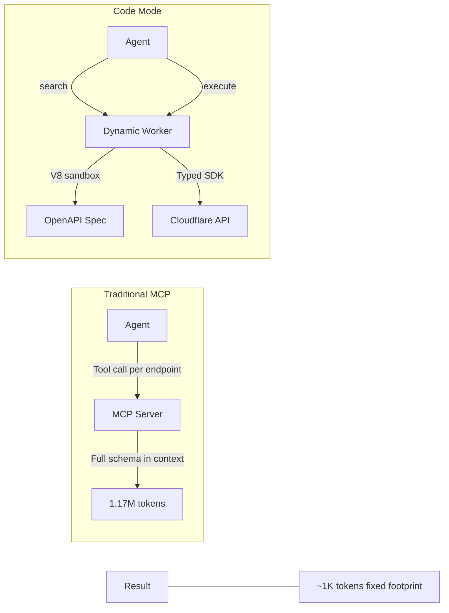

## Summary

The MCP scaling problem is real. Cloudflare's full API would consume 1.17 million tokens as traditional MCP tool definitions—more than most models can even hold. Code Mode flips the approach: instead of exposing thousands of individual tools, give the agent exactly two—`search()` and `execute()`—running inside a Dynamic Worker isolate. The agent writes JavaScript to query the OpenAPI spec and chain API calls. Fixed ~1K token footprint regardless of how many endpoints exist.

This is the most convincing answer I've seen to the MCP context problem that [[why-model-context-protocol-does-not-work]] diagnosed.

::

## How It Works

**Search tool:** The agent writes JavaScript against a pre-resolved OpenAPI spec to find relevant endpoints. Querying WAF and ruleset endpoints narrows 2,500+ total endpoints to the handful actually needed—without loading the entire spec into context.

**Execute tool:** The agent chains multiple API calls together in a single execution, handling pagination, validation, and response chaining. No manual stitching of individual API operations.

Both tools run inside a Dynamic Worker isolate—a lightweight V8 sandbox with no file system and no environment variables to leak. Server-side execution, no client modifications needed.

## Why This Matters

The numbers tell the story:

- **99.9% token reduction** compared to traditional MCP
- Fixed footprint regardless of endpoint count
- OAuth 2.1 compliant with permission downscoping
- Progressive discovery built in—agents find what they need as they go

This is the same principle behind [[dynamic-context-discovery]]—don't stuff everything into context upfront, let the agent pull what it needs. Cursor proved the pattern with files as the abstraction layer. Cloudflare proves it works with APIs too, using code as the query language.

## Alternatives Compared

Cloudflare positions Code Mode against three other approaches:

- **Client-side Code Mode** (Goose, Anthropic Claude SDK) — requires secure sandbox access on the client side
- **CLI tools** (OpenClaw, Moltworker) — broader attack surface than sandboxed workers
- **Dynamic tool search** — reduces context costs but still carries ongoing maintenance overhead

The server-side V8 sandbox approach sidesteps the security concerns of client-side execution while keeping the token budget tight.

## Connections

- [[why-model-context-protocol-does-not-work]] — Gospodarczyk diagnosed exactly the problem Code Mode solves: context bloat from tool schemas consuming tokens before work begins
- [[dynamic-context-discovery]] — Cursor's "pull don't push" pattern for context is the same insight applied to code files; Code Mode applies it to API schemas
- [[playwright-cli-vs-mcp]] — Another case where the standard MCP approach wastes tokens (4x more than CLI), reinforcing that raw MCP doesn't scale for large tool surfaces
