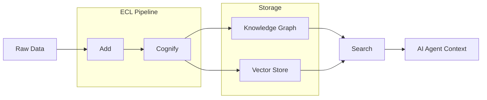

## Overview

Cognee solves the memory problem that plagues every AI agent: context windows are finite and stateless. Feed it documents, text, or any data format, and it builds a dual-index — knowledge graphs for relationships, vector stores for semantic search — that agents can query for relevant context on demand.

The pitch: 6 lines of code to give your agent persistent memory. The reality: those 6 lines hide a serious pipeline underneath — Extract, Cognify, Load — that handles chunking, entity extraction, relationship mapping, and indexing.



::

## Key Features

- **ECL Pipeline** — Extract, Cognify, Load. Data goes in raw, comes out as structured knowledge with entities, relationships, and embeddings
- **Dual search** — Combines graph-based traversal (follow relationships) with vector similarity (find meaning). Neither alone is sufficient
- **Multi-tenant isolation** — User and tenant separation baked in, not bolted on. Critical for production agent systems
- **Ontology grounding** — Knowledge isn't just extracted, it's mapped to defined concepts. Reduces hallucination by anchoring to structure
- **Observability** — OTEL collector integration and audit trails. You can trace why an agent got a specific piece of context

## Code Snippets

### Installation

```bash
pip install cognee
```

### Core API — 6 Lines of Memory

The entire add-cognify-search loop in one shot.

```python
import cognee
import asyncio

async def main():
    await cognee.add("Cognee turns documents into AI memory.")
    await cognee.cognify()
    results = await cognee.search("What does Cognee do?")
    for result in results:
        print(result)

asyncio.run(main())
```

### CLI Alternative

```bash
cognee-cli add "Cognee turns documents into AI memory."
cognee-cli cognify
cognee-cli search "What does Cognee do?"
```

## Technical Details

Built on Python (93.4%), async-first architecture. Uses Neo4j for graph storage by default, with vector database support for embedding-based retrieval. Supports multiple LLM providers — configure via environment variables or `.env` file. Requires Python 3.10-3.13.

The architecture leans on cognitive science concepts — not just vector similarity, but structured knowledge representation. The "cognify" step does the heavy lifting: chunking, entity recognition, relationship extraction, and embedding generation in a single pipeline pass.

## Connections

- [[advanced-context-engineering-for-coding-agents]] - Both tackle the same core problem from different angles: how do you give AI agents the right context? That repo focuses on prompt-level context management, Cognee attacks it at the infrastructure layer with persistent knowledge graphs
- [[ai-assisted-development]] - Cognee is the kind of infrastructure that makes AI-assisted development actually work at scale — agents that remember previous sessions, understand your codebase relationships, and don't lose context mid-conversation
