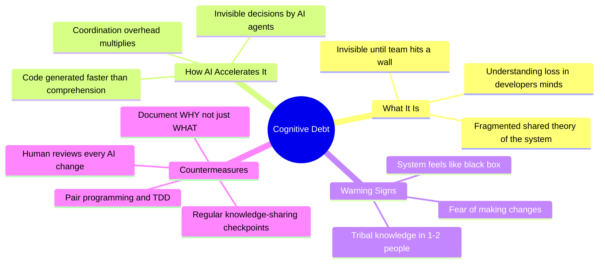

Here's a distinction that's been hiding in plain sight: technical debt lives in the code, cognitive debt lives in developers' heads. Storey, a researcher who's spent decades studying how developers actually understand systems, argues that AI is about to make the second kind far more dangerous than the first.

## The Core Argument

Peter Naur wrote in 1985 that a program is a theory — a shared mental model of what the system does, how intentions map to implementation, and how changes should be made. That theory lives across the team, not in the code. When the theory fragments, the team loses the ability to evolve the system safely.

AI and agentic coding tools accelerate this fragmentation. Code gets generated faster than anyone can build understanding. Each AI agent introduces invisible decisions that no human reviewed. The coordination overhead Fred Brooks warned about in The Mythical Man-Month doesn't disappear when the "extra hands" are AI agents — it multiplies.

::

## The Speed Paradox

Storey uses a classroom example that resonates: a student team building software for an entrepreneurship course hits a wall around week 7-8. Everyone assumed the problem was technical debt. Deeper investigation revealed the real blocker — team members couldn't explain design rationales or how system parts connected. Their shared theory had fragmented. The code was fine. The understanding wasn't.

Kent Beck's principle applies directly: make the hard change easy, then make the easy change. Rushing — especially with AI tools that reward velocity — skips the foundational work that prevents cognitive debt from accumulating. Velocity without understanding is not sustainable.

## Warning Signs

Storey identifies three signals that cognitive debt is building:

- **Change paralysis** — Team hesitates to modify anything because nobody can predict side effects
- **Knowledge silos** — One or two people hold all the "tribal knowledge" about why things work
- **Black box syndrome** — The system feels increasingly opaque, even to the people who built it

## What This Means for AI-Augmented Teams

The countermeasures aren't revolutionary — code reviews, pair programming, TDD, retrospectives. What's new is the urgency. When AI can generate a week's worth of code in an afternoon, the traditional pace of building shared understanding falls catastrophically behind. The gap between production speed and comprehension speed is the cognitive debt accumulating.

The most important practice: at least one human must fully understand every AI-generated change before it ships. Document not just what changed but why. These aren't optional rituals — they're load-bearing walls.

## Connections

- [[tidy-first]] — Kent Beck (whom Storey directly cites) makes the economic case for understanding code before changing it — tidying is cognitive debt prevention disguised as refactoring
- [[how-ai-will-change-software-engineering]] — Fowler's warning about vibe coding removing the "learning loop" is the same problem Storey names: generating code without building the mental model
- [[ai-is-a-high-pass-filter-for-software]] — Finster argues AI amplifies existing capability gaps; Storey explains the mechanism — the gap is cognitive debt accumulating faster in teams that already lack shared understanding
