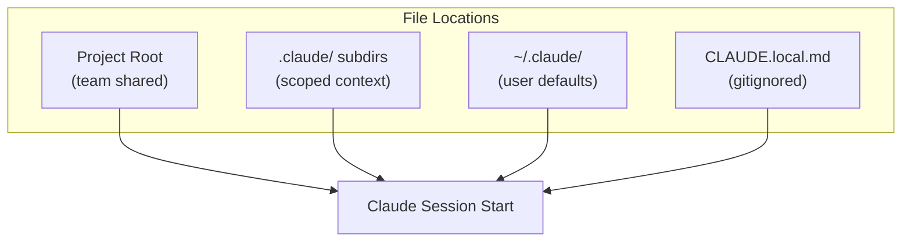

## Summary

Claude has no memory between sessions. Developers repeatedly specify code preferences, testing procedures, and project conventions with each new conversation. A `CLAUDE.md` file solves this by loading automatically at the start of every session—the highest-leverage configuration point for Claude Code.

## Key Points

- **File locations**: Project root (for team collaboration), `.claude/` subdirectories, or `~/.claude/` for user-level defaults
- **`/init` command**: Generates a starter file based on project structure
- **`CLAUDE.local.md`**: Personal preferences kept out of version control
- **Essential sections**: Project context, code style preferences, command syntax, project-specific warnings

## Structure

The article recommends organizing `CLAUDE.md` around:

1. **Project context** — One-line description of what the project does
2. **Code style preferences** — Formatting and convention guidance
3. **Command syntax** — Testing, building, deployment commands
4. **Gotchas and warnings** — Project-specific pitfalls to avoid

## Notable Quote

> "One file. Loaded before every conversation. If you're using Claude Code, this is where your setup time pays off most."

## Diagram

::

## Connections

- [[writing-a-good-claude-md]] — HumanLayer's complementary guide with specific principles: keep it under 300 lines, use progressive disclosure, avoid auto-generated content
- [[context-engineering-guide]] — Map of context engineering strategies including CLAUDE.md configuration
