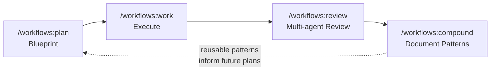

## Overview

The Compound Engineering Plugin is a Claude Code marketplace plugin that structures AI-assisted development around a core thesis: each unit of engineering work should make subsequent units easier. Instead of accumulating technical debt over time, the workflow inverts the traditional 80/20 split—spending 80% of effort on planning and review, and 20% on execution.

## Key Features

- **Plan workflow** — Converts ideas into detailed implementation blueprints before writing any code
- **Work workflow** — Executes plans using git worktrees and task tracking for isolated, parallel development
- **Review workflow** — Multi-agent code review before merging, catching issues that single-pass reviews miss
- **Compound workflow** — Documents learnings as reusable patterns, closing the feedback loop so future plans start better informed

## Code Snippets

### Installation

```bash
/plugin marketplace add https://github.com/EveryInc/compound-engineering-plugin
/plugin install compound-engineering
```

### Cross-Platform Support

```bash
# OpenCode/Codex (experimental)
bunx @every-env/compound-plugin install compound-engineering --to opencode
```

## The Compounding Loop

Each workflow stage feeds the next. Plans inform execution, execution surfaces issues in review, and reviews capture patterns that improve future plans.



::

The feedback loop is the differentiator. Most AI coding tools optimize for speed of execution. Compound engineering optimizes for speed of learning—each cycle produces not just working code, but documented patterns that make the next cycle faster and more reliable.

## Technical Details

Built with Bun and TypeScript. The plugin also supports syncing personal Claude Code configurations (skills from `~/.claude/skills/`, MCP servers) to other platforms via symlinks, making compound patterns portable across tools.

## Connections

- [[claude-tasks-beads-compound-engineering-convergence]] — Explores how Claude Code's native task system intersects with the compound engineering plugin's own todo tracking, and the open question of whether to extend or replace custom approaches
- [[superpowers]] — Another Claude Code skills library with structured workflows for brainstorming, TDD, and debugging; shares the philosophy of encoding engineering best practices into reusable agent skills
- [[self-improving-skills-in-claude-code]] — The self-correcting CLAUDE.md pattern is the same compounding insight at a different scale: each mistake becomes a permanent lesson, mirroring how `/workflows:compound` captures patterns for reuse
