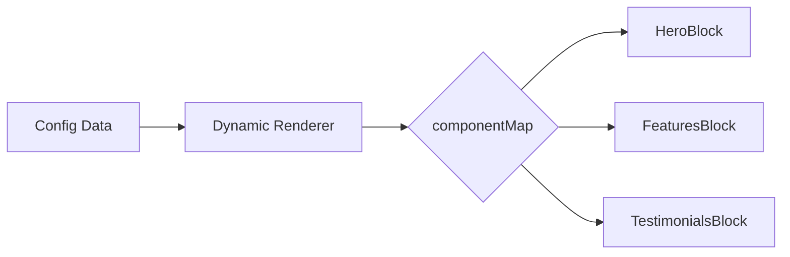

## Summary

Config-driven interfaces flip the traditional approach: instead of hardcoding component hierarchies, you define a data structure that describes what to render. Vue's `<component :is>` primitive makes this pattern elegant.

## Key Concepts

### The Component Map Pattern

Map configuration types to actual components explicitly rather than using dynamic resolution:

```vue
<script setup>
const componentMap = {
  hero: HeroBlock,
  features: FeaturesBlock,
  testimonials: TestimonialsBlock,
};
</script>

<template>
  <component
    v-for="block in blocks"
    :key="block.id"
    :is="componentMap[block.type]"
    v-bind="block.props"
  />
</template>
```

This approach provides strong component boundaries, better type safety, and clear ownership of what can render.

### When to Use Config-driven UIs

The pattern shines for:

- **CMS-driven websites** where editors control page structure
- **Page builders** with drag-and-drop interfaces
- **A/B testing** where variants are defined in configuration
- **White-label products** with customizable layouts

### Pitfalls to Avoid

**Overusing dynamic rendering.** Static layouts that never change don't benefit from this complexity.

**Leaking logic into configuration.** Configuration should describe "what," not "how." Conditional logic belongs in code, not data.

**Ignoring performance.** Dynamic components still mount and re-render. Use `markRaw` for component references, `KeepAlive` for caching, or `defineAsyncComponent` for code splitting.

## Visual Model



::

## Connections

- [[12-design-patterns-in-vue]] - Pattern #9 (Strategy Pattern) covers the same `<component :is>` technique for conditional rendering
