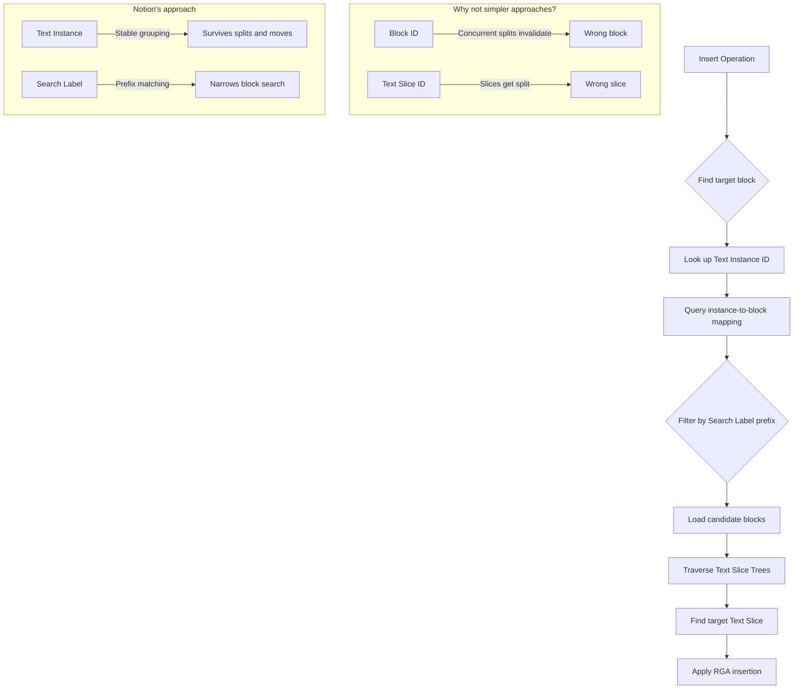

## Overview

Angelique Nehmzow walks through how Notion moved from last-write-wins to CRDTs for real-time collaboration and offline editing. The interesting part isn't the CRDT itself — Notion uses RGA, which is well-understood — it's everything they had to build on top of it to handle Notion's block model. Blocks split, merge, nest, and move. Standard CRDTs don't account for any of that.

The talk is a masterclass in the gap between "we'll use CRDTs" and actually shipping CRDTs in a product used by 100 million people.

## Key Arguments

### The Block Model Complicates Everything

Notion organizes content into blocks — reorderable, nestable, splittable, mergeable units. Text in one block can be split across two blocks, or two blocks can merge into one. This fundamentally changes the conflict resolution problem: you can't just resolve text conflicts within a single document. You need to resolve conflicts _across_ blocks that may have been concurrently restructured.

### RGA Gets You Started, Not Finished

Notion uses RGA (Replicated Growable Array) — each character gets a unique ID (client identifier + counter), stored in a grow-only tree. Combined with Peritext for rich text formatting. This handles concurrent text insertion within a single sequence. But Notion needed to handle operations that span block boundaries.

### Text Slices and Text Slice Trees

To handle splits and merges, Notion introduced **text slices** — segments of text with a start item, end item, and text items in between. A **split item** marks where a slice was divided. These slices form trees (text slice trees) per block, where splits create child nodes. Moving text between blocks means moving slices between trees.

::

### The Text Instance Trick

The core problem: when you want to insert a character, you need to find the right block. You can't use block ID (a concurrent split might have moved the target text to a different block). You can't use text slice ID (the slice itself might have been split). Notion's solution: **text instances** — a stable grouping that stays the same even when slices split or move between blocks. When a block is created, its text belongs to a new text instance. That assignment is permanent, regardless of how many times the content gets split or rearranged.

### Search Labels Solve the Scale Problem

Text instances alone create a fan-out problem. If a block gets split 99 times, you end up with 100 blocks sharing the same text instance — and you'd have to load all 100 to find one slice. Notion's answer: **search labels**. Each slice gets an append-only label (L for left after a split, R for right). Prefix matching on these labels narrows the search. If your operation targets label "R" and a concurrent split created "RL" and "RR", prefix matching finds both candidates without loading the entire instance.

## Notable Quotes

> "We had a last write win system. When two editors were making changes at exactly the same time, whoever's edits came in last would overwrite the other user's edits."
> — Angelique Nehmzow

> "We actually do compress text — the characters into words. I just didn't show it that way in the presentation."
> — Angelique Nehmzow, on operation granularity

## Practical Takeaways

- Standard CRDTs (even good ones like RGA) need significant extension when your data model involves structured, splittable, mergeable units
- Stable identity that survives structural changes (text instances) is more useful than pointing at mutable containers (block IDs, slice IDs)
- Append-only labels with prefix matching provide an elegant middle ground between "load everything" and "hope your pointer is still valid"
- Rolling out CRDTs by workspace, with backward-compatible operation upgrading on the server, is a practical incremental migration strategy
- Coordinating CRDT launch with offline mode means converting blocks on download — letting two teams share testing surface area

## Connections

- [[crdts-solved-conflicts-not-sync]] — Adam Fish argues CRDTs are the easy part of a sync engine. Angelique's talk is the perfect complement: even within the CRDT layer itself, Notion had to invent new abstractions (text instances, search labels) to handle their block model. "Easy" is relative.
- [[a-gentle-introduction-to-crdts]] — Covers foundational concepts (RGA, logical clocks, last-write-wins) that Angelique builds directly on top of. Her talk shows what happens when you try to apply these primitives to a real product with complex data structures.
