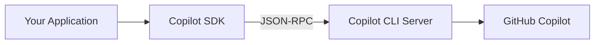

## Overview

GitHub's Copilot SDK provides language-specific bindings for integrating Copilot CLI functionality into applications. The SDK handles the communication layer between your app and the Copilot CLI server, enabling programmatic access to GitHub's AI coding assistant.

The project sits in technical preview. APIs may change before stable release.

## Key Features

- **Multi-language support**: TypeScript, Python, Go, and .NET implementations
- **Automatic lifecycle management**: SDK handles CLI process initialization and shutdown
- **Flexible connectivity**: Use the managed process or connect to external CLI servers
- **JSON-RPC communication**: Standardized protocol between app code and Copilot

## Architecture

The SDK functions as a bridge between application code and the Copilot CLI:



::

## Code Snippets

### Installation

```bash
# Node.js/TypeScript
npm install @github/copilot-sdk

# Python
pip install github-copilot-sdk

# Go
go get github.com/github/copilot-sdk/go

# .NET
dotnet add package GitHub.Copilot.SDK
```

### Basic Usage (TypeScript)

```typescript
import { CopilotClient } from "@github/copilot-sdk";

const client = new CopilotClient();
await client.initialize();

// Use Copilot capabilities through the client
```

## Technical Details

The codebase splits roughly evenly across languages: TypeScript (32.9%), Python (24.1%), C# (21.5%), and Go (20.4%). This distribution reflects GitHub's commitment to first-class support across major ecosystems.

Prerequisites include installing the Copilot CLI separately. The SDK doesn't bundle the CLI itself.

## Connections

- [[claude-agent-sdk-full-workshop]] - Anthropic's parallel approach to agent SDKs, packaging Claude Code patterns for building coding agents
- [[how-to-build-a-coding-agent]] - Explains the fundamental agent loop that SDKs like this implement under the hood
