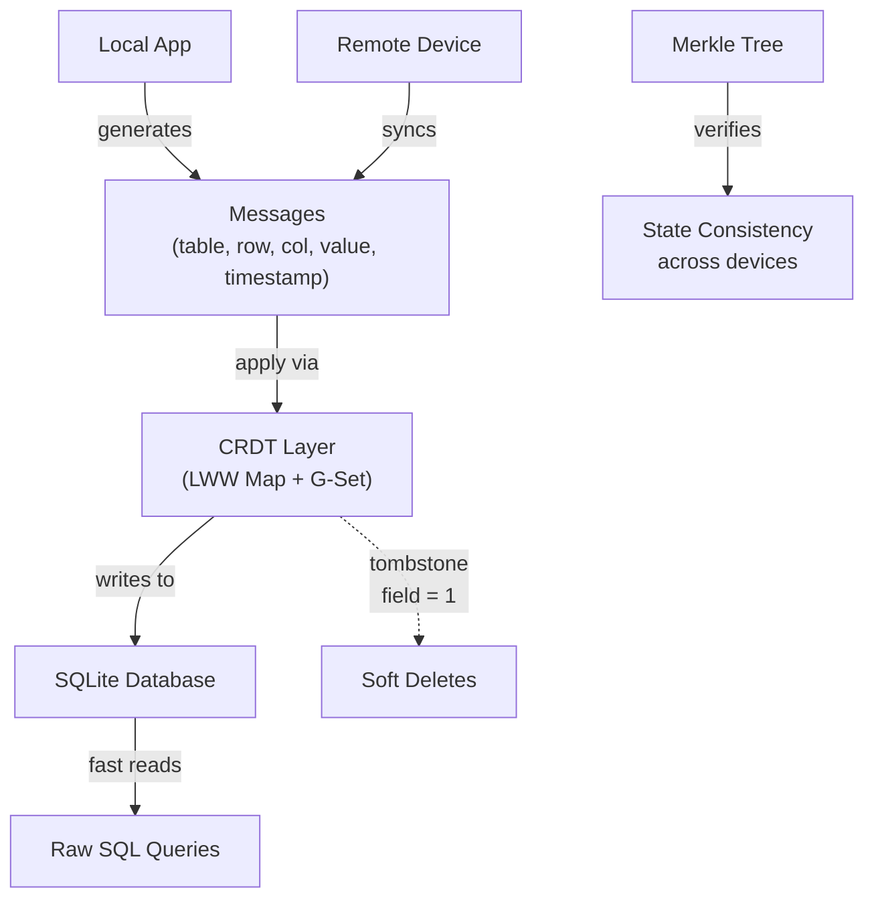

## Overview

James Long — the person who created Prettier because he got tired of formatting while building Actual Budget — walks through how he implemented offline-first sync using CRDTs. The approach is radically simple: treat your SQLite tables as CRDTs, layer a message-based sync protocol on top, and the whole thing fits in roughly 630 lines of JavaScript with two dependencies.

This is the talk that [[why-local-first-apps-havent-become-popular|Marco Bambini's article]] essentially summarizes — hearing it from James directly gives you the implementation details and the "why" behind each design choice.

## Key Arguments

### Local-First Is a Complete Re-architecture

Local-first doesn't mean "add offline support later." It means all code and all data live on the device. The app boots offline. The server is optional. This is why James prefers "local-first" over "offline-first" — it better captures the full inversion.

### Syncing Has Two Hard Problems

1. **Unreliable ordering** — distributed devices receive changes in different sequences. Naive mutation produces divergent state.
2. **Conflicts** — two devices can modify the same data while disconnected. Manual conflict resolution doesn't work ("Did you just ask me to go screw myself?").

### Hybrid Logical Clocks Solve Ordering

HLCs generate per-device timestamps that establish causal ordering without centralized coordination. The entire implementation is 256 lines of JavaScript with zero dependencies. James's point: complex problems don't require complex solutions. The clock gives you a string you can compare — if string A < string B, event A happened before B. That's all you need.

This connects directly to [[a-gentle-introduction-to-crdts|Matt Wonlaw's CRDT intro]] which explains the theory of logical clocks — James shows the practical result.

### CRDTs Are Just Two Properties

Strip away the academic language and CRDTs are data structures that are:

- **Commutative** — order of applying changes doesn't matter
- **Idempotent** — applying the same change multiple times has no additional effect

That's it. Those two properties let you "throw changes over the wall" — if state diverges, throw more changes. Eventually everything converges.

### SQLite as CRDT: The Implementation

The entire sync layer is one additional table — a `messages_crdt` table with columns: timestamp, dataset (table name), row (item ID), column, and value. Each message sets a single cell. If the timestamp is newer than what's stored, the value wins. If the row doesn't exist, it gets created.

::

Local mutations and remote sync follow the exact same code path — both generate messages and push them through the CRDT layer. Reading is just raw SQL. Deletes are soft: set a `tombstone` field to 1, filter on read.

### Simplicity as a Reliability Strategy

Dijkstra: "Simplicity is a prerequisite for reliability." The full client-side sync implementation is 630 lines. The server is 132 lines. Two dependencies: UUID and murmurhash. James makes the point viscerally — "it's 65 tweets worth of code."

## Notable Quotes

> "Local apps they are a distributed system — there's no way around that."
> — James Long

> "Manual conflict resolution does not work. It's basically just issuing one of the hardest parts of this whole thing on to you."
> — James Long

> "Complex problems do not necessarily beget complex solutions."
> — James Long

## Practical Takeaways

- Use a **Last-Write-Wins Map** (LWW Map) for individual records and a **Grow-Only Set** (G-Set) for collections — these two primitives cover most app data models
- Keep SQLite as your database — add sync as a layer on top rather than replacing your storage engine
- Shape your data to avoid conflicts rather than trying to resolve them after the fact
- Use Merkle trees to verify consistency across clients without transferring full state
- Soft-delete everything — never remove rows from a distributed set

## Connections

- [[why-local-first-apps-havent-become-popular]] - Bambini's article is essentially a written summary of this talk's core argument about why syncing is hard
- [[a-gentle-introduction-to-crdts]] - Covers the same CRDT fundamentals (LWW, logical clocks, G-Sets) from a theoretical angle — James provides the practical implementation
- [[crdts-the-hard-parts]] - Kleppmann's talk picks up exactly where James stops: what happens when these simple CRDT primitives hit real-world edge cases like text editing and tree moves
- [[local-first-software]] - The Ink & Switch essay that coined the term "local-first" and laid out the seven ideals James is building toward with Actual
- [[crdts-solved-conflicts-not-sync]] - Adam Fish's Local-First Conf talk argues the same point James demonstrates: CRDTs are the easy part, transport and sync infrastructure are the real engineering challenge
