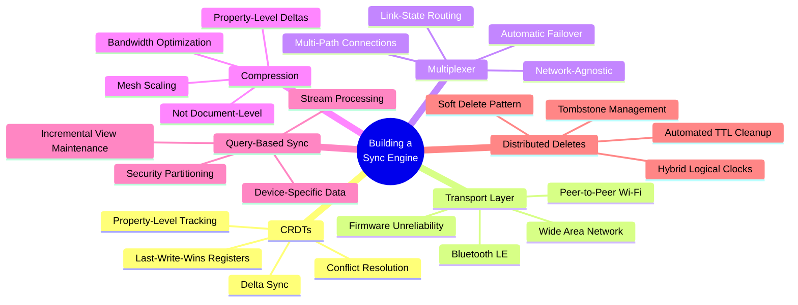

## Overview

Adam Fish, CEO of Ditto, arrives with eight years of hard-won sync engine experience and a message the CRDT-enthusiast crowd probably needs to hear: conflict resolution is the solved part. Everything around it — the networking, the compression, the query routing, the deletes — that's where the real engineering lives.

Fish built sync engines at Realm (OT-based, acquired by MongoDB) and then started Ditto in 2018 specifically to build a better one using CRDTs. He and his co-founder were convinced CRDTs would save everything. The CRDT implementation took months. The five systems surrounding it took years — and they're still iterating on deletes.

## Key Arguments

### CRDTs Are the Easy Part

The initial CRDT implementation at Ditto was fast. A last-write-wins register — which Fish argues is the main data type that provides real value to application developers — is not even conceptually that difficult to build. The math for convergence is efficient and scalable. But building CRDTs and building a sync engine are two very different problems.

### Transport Is the Real Beast

Ditto's differentiator is mesh networking over Bluetooth LE, peer-to-peer Wi-Fi, and other radios. Building this transport layer was "immensely more complex" than the CRDT work. Bluetooth firmware is shockingly unreliable — even across Apple devices, which should be the gold standard for hardware-software integration. Android, Windows, and Linux multiply the chaos. Ditto does extensive physical device testing because you can't simulate firmware bugs.

### Multiplexing Hides the Chaos

Ditto's solution to unreliable transports: use all of them simultaneously. If Bluetooth drops, route through peer-to-peer Wi-Fi. The multiplexer is network-agnostic, maintaining link-state routing tables across the mesh to determine optimal paths. The end user doesn't care which transport delivered their data — they just need it to arrive.

::

### Property-Level Deltas, Not Documents

Sending entire documents over Bluetooth is a non-starter. Ditto tracks changes at the property level — each property in a document is an atomic unit with its own last-write-wins register. If you only changed the `status` field on a large enterprise document, only that delta gets transmitted. This matters exponentially in a mesh where bandwidth costs scale with the number of connections.

### Query-Based Sync Partitions the Problem

Fish is passionate about query-based sync — an API pattern he helped introduce at Realm. Transmitting entire datasets is impractical. Ditto uses incremental view maintenance (IVM) as a stream processing system: devices subscribe to queries, and only matching changes propagate. A kitchen display and an order-taking tablet in the same restaurant get different data — not just for efficiency, but for security.

### Deletes Are Still Hard

The running joke in distributed systems holds: deletes are the last thing you solve. Ditto settled on soft deletes with tombstones, tracked via hybrid logical clocks (physical timestamps + logical counters in a vector clock). They're moving toward automated TTL-based cleanup so developers don't have to manage tombstone eviction manually. This is the area they're still actively iterating on.

## Notable Quotes

> "CRDTs are a solid substrate to a sync engine, but there are many other things that need to happen to build it all together."
> — Adam Fish

> "Building this part out was just immensely more complex and is still a challenge that we face today as we encounter additional radios."
> — Adam Fish, on the transport layer

## Practical Takeaways

- If you're building a sync engine, don't stop at the CRDT — plan for transport, compression, query routing, and deletes from the start
- Last-write-wins registers cover most application developer needs; exotic CRDT types are rarely worth the complexity
- Property-level change tracking is essential for bandwidth-constrained environments (BLE, mesh networks)
- Query-based sync with IVM is the API pattern that makes sync practical for real applications
- Distributed deletes remain genuinely hard — soft delete + HLC + automated TTL is the current best practice

## Connections

- [[local-first-software]] — The foundational essay that called for "Firebase for CRDTs." Fish's experience at Ditto reveals that CRDTs were the easy part of answering that call — the infrastructure around them is where the real complexity lives.
- [[general-purpose-sync-with-ivm]] — Aaron Boodman's talk on Zero's query-driven sync describes the same IVM pattern Fish champions. Both arrived at query-based sync independently as the key API for practical sync engines.
- [[can-sync-be-network-optional]] — Brendan O'Brien's talk is the perfect complement: while Fish focuses on making the network work despite unreliability, O'Brien asks whether we can design sync to not need the network at all.
- [[sync-engines-for-vue-developers]] — Ditto is one of the sync engines surveyed. Fish's talk provides the behind-the-scenes architecture of what makes it work.
