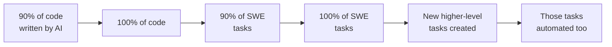

The core tension of this interview: Dario holds extreme private probability estimates about near-term AI capability ("country of geniuses in 1-3 years," 90% within a decade) but acts with apparent moderation. The explanation isn't doubt — it's financial physics. Buying compute one year too early can bankrupt you even if you're right about the trajectory.

That framing alone makes this worth sitting with. Most AI discourse splits into "this changes everything overnight" versus "it's just autocomplete." Dario occupies a third position: the capability exponential is real and steep, but the economic diffusion exponential lags behind it, and that gap is where all the interesting strategy lives.

## Key Arguments

**The Big Blob of Compute Hypothesis.** Dario claims the same log-linear scaling laws from pre-training now appear in RL across diverse tasks — not just math contests. The public narrative that RL is a mysterious new paradigm is wrong. It's the same insight he wrote about in 2017: raw compute, data, and a scalable objective function matter more than clever methods. Everything else is subordinate.

**Continual learning might be a red herring.** Dwarkesh pushes on "learning on the job" as a missing capability. Dario's counter: massive pre-training generalization plus million-token context windows already cover most of what people mean by on-the-job learning. Coding proves the point — models read the codebase into context and skip the months of human ramp-up.

**Fast but not infinitely fast.** Two extremes are wrong: that AI diffuses slowly like previous technologies, and that recursive self-improvement hits overnight. Anthropic's own growth (zero to ~$10B revenue in three years) is empirical evidence for the middle path — extremely fast, but bottlenecked by enterprise procurement, compliance, and human change management.

**The compute purchasing dilemma.** Being off by one year in demand prediction when buying data centers can destroy you. Log-linear returns mean diminishing value from over-investing. This structural constraint explains why Anthropic appears "conservative" despite radical beliefs about timeline.

**AI industry economics look like cloud, not social media.** Three to four players, high barriers, differentiated products, positive margins — a Cournot equilibrium, not winner-take-all. Models are more differentiated than cloud infrastructure, so margins should be better than AWS/Azure/GCP.

## The SWE Automation Spectrum

Dario lays out a graded progression that clarifies most disagreements about AI and jobs:

::

Each step is qualitatively different. Conflating them causes most arguments about whether AI "replaces" developers. We're somewhere around the first two stages — which is transformative for productivity but doesn't eliminate the role.

## Notable Quotes

> "It is absolutely wild that you have people — within the bubble and outside the bubble — talking about the same tired, old hot-button political issues, when we are near the end of the exponential."

> "If we had the 'country of geniuses in a data center', we would know it. Everyone in this room would know it. Everyone in Washington would know it. We don't have that now."

> "There is zero time for bullshit. There is zero time for feeling like we're productive when we're not."

> "If my revenue is not $1 trillion dollars, if it's even $800 billion, there's no force on earth, there's no hedge on earth that could stop me from going bankrupt if I buy that much compute."

## The Authoritarianism Angle

The most surprising claim: Dario hopes dictatorships become "morally obsolete." His argument — AI-powered surveillance makes authoritarianism qualitatively worse, which could generate sufficient backlash to dissolve authoritarian structures from within. He wants AI built with properties that make it infeasible for governments to deny populations private access. Idealistic, but he seems to genuinely believe it's achievable.

## Connections

- [[the-singularity-will-occur-on-a-tuesday]] — Cam Pedersen argues the singularity is already here as institutional collapse under accelerating change. Dario's "two exponentials" model offers a more precise version: capability races ahead, diffusion lags, and the gap is where the disruption actually lives.
- [[the-age-of-the-generalist]] — Alexander's own argument that AI eliminates routine tasks but not architectural judgment maps directly onto Dario's SWE automation spectrum. The "90% of code" stage is exactly the generalist's advantage.
- [[ai-is-a-high-pass-filter-for-software]] — Bryan Finster's claim that AI amplifies existing capability rather than replacing it echoes Dario's point about diffusion — organizations with strong foundations absorb AI faster, widening the gap.
