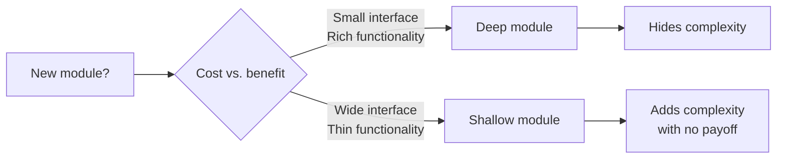

## The Core Argument

Every module has a cost and a benefit. The cost is the **interface** — the surface area a caller has to understand. The benefit is the **functionality** hidden behind that surface. Good design maximises the ratio.

- **Deep module:** small interface, lots of functionality behind it. Hides complexity.
- **Shallow module:** wide interface, thin functionality. In the extreme case, using it costs more than the code it wraps.

Zdražil is summarising a chapter from John Ousterhout's _A Philosophy of Software Design_, but the reframing is what makes the article useful: instead of arguing about file counts or line length, you evaluate every new module with one question — _does this abstraction earn its interface?_

## Why This Reframes the "Small Functions" Dogma

A lot of frontend code (Vue, React, TS) gets over-modularised because "small functions" is treated as an unconditional good. Zdražil's TypeScript example makes the counter-point concrete: a chain of one-line selectors (`getCancellationPolicies`, `isCancellationPolicyFree`, `isSomeProductCancellationPolicyFree`, `hasProductGroupFreeCancellation`) looks clean in isolation, but each call site has to trace through four files to understand a single filter. Inlining them into one deeper function — `hasProductGroupFreeCancellation(state, productGroupId)` — shrinks the interface from five exports to one, and the logic becomes easier to refactor once it's visible at a glance.

The "small functions" rule optimises the wrong variable. The real question is how much cognitive interface you're forcing on callers.

## Key Insights

- **Cost = interface, not implementation.** Callers pay for what they must learn to use a module, not for what's hidden.
- **Informal interface counts too.** Behavioural quirks, usage restrictions, and "don't call this before X" rules live in comments — they inflate the interface whether the compiler sees them or not.
- **Extreme shallowness is an anti-abstraction.** A wrapper that needs more documentation than the variable it wraps should be deleted, not kept.
- **Proximity reveals refactors.** Pulling shallow modules back together often exposes simpler implementations (his example replaces nested `some` with a single `includes` once the pieces are co-located).
- **Deep modules trade off testability.** Not mentioned in the article, but worth holding in tension — very deep modules are harder to unit-test in isolation, which is part of why [[functional-core-imperative-shell-pattern]] still matters.

## Why I Care

This is the clearest lever I've seen for pushing back on over-engineered TypeScript codebases. When AI-assisted coding makes it trivial to generate layers of helper functions, the "deep vs shallow" frame gives a principled reason to consolidate. It also fits the pattern from [[tidy-first]]: Beck's "extract helper" and "normalize symmetries" are moves _toward_ deeper modules, not just toward more modules.

## Connections

- [[tidy-first]] - Kent Beck's tidyings describe the low-level moves (extract, inline, chunk) that shift a codebase toward deeper modules. Ousterhout's deep/shallow framing provides the _criterion_ for when a tidying is worth doing.
- [[functional-core-imperative-shell-pattern]] - A specific instance of a deep module: the core hides rich business logic behind a pure-function interface, while the shell stays thin. Useful productive tension, though — the FCIS style sometimes pushes toward _more_ modules (clear boundary) rather than fewer.
- [[6-levels-of-reusability]] - Thiessen's warning that "each level trades simplicity for flexibility" is the same cost-benefit calculus applied to Vue components. Over-reaching for reuse is the component-level equivalent of a shallow module.
- [[graphql-schema-design-principles]] - Neuse's client-centric schema design is essentially an argument for deep schema modules: a small number of capability-oriented types that hide the backend's shape, rather than exposing every entity.
- [[you-cant-design-software-you-dont-work-on]] - Goedecke's point that hands-on knowledge beats generic advice applies directly here: knowing whether a module _in this codebase_ is deep or shallow requires working on it, not sketching boxes from outside.
