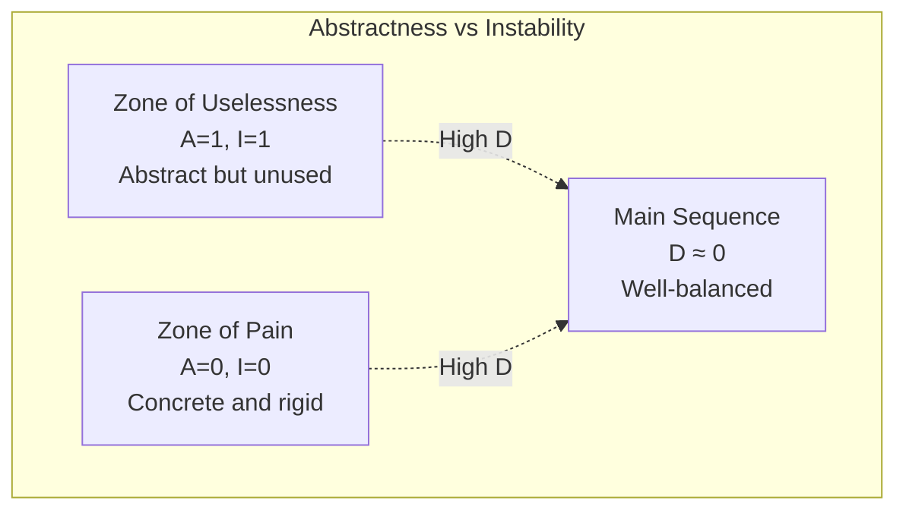

AI coding assistants produce code that runs. The question is whether that code will survive contact with maintenance. Normalized Distance from Main Sequence provides an objective answer.

## The Metric

Robert C. Martin ("Uncle Bob") defined the Main Sequence as the ideal relationship between two properties of a software component:

**Abstractness (A)** — Ratio of abstract classes/interfaces to total classes

- A = 0: Completely concrete (all implementation)
- A = 1: Completely abstract (all interfaces)

**Instability (I)** — Ratio of outgoing dependencies to total dependencies

- I = 0: Stable (many depend on it, it depends on nothing)
- I = 1: Unstable (it depends on many, nothing depends on it)

**Distance from Main Sequence (D):**

```text
D = |A + I - 1|
```

A well-designed component has D ≈ 0. It sits on the diagonal line where abstractness and instability balance. High D scores indicate architectural problems.

## Visual Model



::

## The Two Failure Zones

**Zone of Pain** (bottom-left: high stability, low abstractness)

- Concrete code everything depends on
- Impossible to change without breaking the system
- Example: A massive database schema with no abstraction layer

**Zone of Uselessness** (top-right: high abstractness, high instability)

- Interfaces and abstract classes nobody implements
- Boilerplate that adds complexity without value
- Example: Factory patterns wrapping single implementations

## Why This Detects AI Code Problems

AI-generated code fails architecturally in predictable ways:

1. **Brute-force implementation** — AI writes working code without considering extension points. Result: concrete, coupled components in the Zone of Pain.

2. **Hallucinated complexity** — AI adds unnecessary abstractions, wrapper classes, and interfaces that serve no purpose. Result: dead code in the Zone of Uselessness.

3. **Missing cohesion** — AI doesn't understand which pieces belong together. Components end up with wrong stability characteristics for their role.

The metric catches what code review misses: code that _works_ but was assembled without architectural intent.

## Complementary Metrics

**Cyclomatic Complexity (M)** — Counts decision points (if/else, loops, cases). High M means spaghetti logic that's hard to test.

```text
M = E - N + 2P
```

Where E = edges, N = nodes, P = connected components in the control flow graph.

Use both: D catches structural problems at the component level; M catches logic problems within methods.

## Practical Application

Tools that calculate these metrics:

- **Java**: JDepend, SonarQube
- **C#**: NDepend
- **Multi-language**: SonarQube, CodeClimate

Wire them into CI. Flag components where D > 0.3 for architectural review before merging.

## Sources

- [[fitness-function-driven-architecture-and-agentic-ai]] — Neal Ford identifies D as the single best metric for detecting AI-generated code quality issues at enterprise scale
- [[building-evolutionary-architectures]] — Ford's earlier work on using metrics as architectural fitness functions
