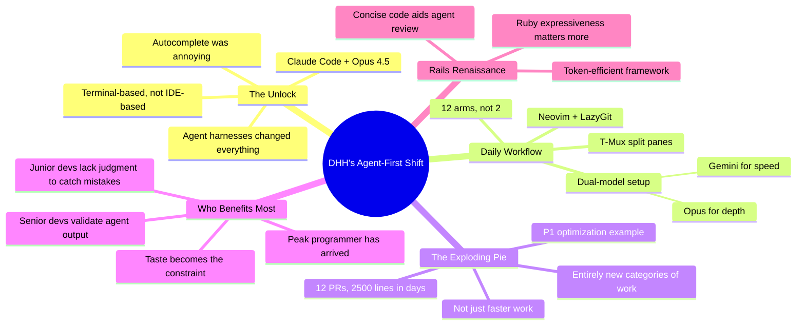

DHH spent years dismissing AI coding tools as glorified autocomplete — annoying, flow-breaking, like someone constantly finishing your sentences. Then Claude Code + Opus 4.5 landed in November 2024, and everything flipped. The shift wasn't incremental. It was a phase change from "stop interrupting me" to "I have 12 arms now."

## Timestamps

| Time   | Topic                                                    |
| ------ | -------------------------------------------------------- |
| 0:00   | Intro and teaser clips                                   |
| ~3:00  | DHH's background: Omachi Linux, scratching your own itch |
| ~8:00  | 37 Signals history: Basecamp, Hey.com, Apple fight       |
| ~22:00 | Product building: tiny teams, designers as PMs           |
| ~28:00 | Aesthetics as truth                                      |
| ~32:00 | AI journey: autocomplete skeptic to agent convert        |
| ~38:00 | The unlock: Claude Code + Opus 4.5                       |
| ~42:00 | Daily workflow: dual-model, Neovim, LazyGit, T-Mux       |
| ~46:00 | OpenClaw: agents signing up for products autonomously    |
| ~54:00 | Senior vs. junior bifurcation under AI                   |
| ~60:00 | The exploding pie: P1 optimization story                 |
| ~66:00 | Peak programmer and Jevons paradox                       |
| ~78:00 | Career advice: show up, do great work                    |
| ~82:00 | Maintaining balance, avoiding AI burnout                 |

## Key Arguments

### Agent Harnesses Beat Autocomplete

DHH found Copilot-style tab completion infuriating — it interrupted his thinking flow. The real unlock was terminal-based agent harnesses (Claude Code, Open Code) that work alongside you rather than inside your editor. Combined with Opus 4.5, the experience shifted from annoying interruption to "stepping into a super mech suit." This validates the Unix philosophy: small, composable tools connected via the terminal.

### The Exploding Pie

The biggest impact isn't doing existing work faster — it's tackling work nobody would have bothered with. Jeremy, one of 37 Signals' most agent-accelerated engineers, decided to optimize P1: literally the fastest 1% of requests, taking them from 4ms to under 0.5ms. Twelve PRs, 2,500 lines changed in days. Before agents, that project wouldn't have existed. DHH calls this "the exploding pie" — demand for software expands as production costs collapse.

### Senior Developers Win Disproportionately

The most successful agent-accelerated work at 37 Signals comes from the most senior people. They can validate whether agent output is production-ready. Junior developers lack the judgment to catch agent mistakes — Amazon's internal analysis apparently pinned major outages on junior devs shipping unreviewed agent-generated code. The gap isn't closing; it's widening.

### Peak Programmer Has Arrived

DHH argues the guild of learned programmers commanding high salaries simply because they were the bottleneck is ending. Implementation will be commoditized. The constraint shifts to product management — figuring out _what_ should be built. "For you to get the privilege to just be an implementer, you have to be better than what's available off the shelf from agents."

### Rails Is Having a Renaissance

Ruby on Rails turns out to be "one of the most token efficient ways of building web apps." When agents produce code that humans still need to read and verify, Ruby's expressiveness and conciseness become a material advantage. The framework's conventions align well with agent workflows.

### Current Models Are Already Enough

Even if models stopped improving tomorrow, the industry would spend years learning to extract more value. DHH compares it to the Commodore 64 — games improved dramatically over the platform's lifetime as developers learned to squeeze more from the hardware. We haven't scratched the surface of what existing capabilities enable.

## Notable Quotes

> "Running a bunch of agents feels less like being a project manager for agents and more like stepping into this super mech suit where suddenly I don't just have two arms. I have 12."

> "Before, I would be a little more precious about 75 lines of code because it would have taken me two hours to do them. Now there's no residual value to any of this stuff."

> "The number of projects we have tackled internally that we would never even have contemplated starting on are legion."

> "For you to get the privilege to just be an implementer, you have to be better than what's available off the shelf from agents."

> "I think aesthetics is truth. When something is beautiful, it's likely to be correct."

> "This is not like a limited sale. AI is going to be here next month and the months after that. You damn well better find a way not to get consumed entirely about it."

## Predictions

- **Peak programmer has arrived** — fewer traditionally-trained programmers needed for the same output, especially in cost-center roles
- **Agents will stop needing human accommodations** — the end state is agents navigating browser UIs autonomously, not through CLIs and MCPs
- **Product management becomes the new constraint** — figuring out what to build matters more than implementation
- **Shape Up's two-month cycles are obsolete** — 37 Signals hasn't rewritten the methodology yet, but the old timelines no longer apply

## Resources Mentioned

- **Claude Code / Open Code** — Agent harnesses DHH uses daily
- **Opus 4.5** — The model DHH identifies as the inflection point
- **Gemini K25** — Fast model in his dual-model setup
- **Neovim + LazyGit + T-Mux** — His terminal-based dev environment
- **OpenClaw** — Self-hosted AI agent platform (400K lines of code)
- **Omachi** — DHH's Linux distro built on Arch + Hyprland
- **Smalltalk Best Practices** by Kent Beck — DHH's all-time favorite programming book
- **The Bitter Lesson** by Rich Sutton — General methods leveraging computation always beat human-knowledge approaches

## Connections

- [[dhh-on-programming-rails-ai-and-productivity]] — Same guest six months earlier on Lex Fridman's podcast, but the AI stance has completely reversed. The contrast between DHH-the-skeptic and DHH-the-agent-convert is striking
- [[the-importance-of-agent-harness-in-2026]] — DHH's experience validates Philipp Schmid's argument that agent harnesses, not models, are the real differentiator
- [[openclaw-the-viral-ai-agent-that-broke-the-internet]] — DHH directly references OpenClaw as the experiment that showed agents can navigate products autonomously
- [[ai-codes-better-than-me-now-what]] — Lee Robinson reaches the same conclusion from a different angle: code is cheap, taste is the bottleneck
- [[im-done-jeffrey-way-on-ai-and-coding]] — Another Laravel-adjacent developer who went from AI skepticism to full embrace — the pattern of converted skeptics is becoming a theme
