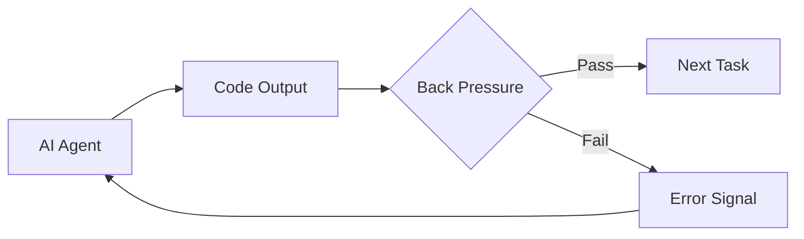

## Summary

Back pressure refers to automated feedback mechanisms that validate an AI agent's output before it proceeds. Huntley argues this is the critical difference between agents that fail at basic tasks and those that can handle progressively complex work. Without structured feedback loops, agents drift and produce faulty outputs.

## Key Points

- **Back pressure as leverage**: Structure around the agent that provides automated feedback on quality and correctness enables longer-horizon task completion
- **Calibration is essential**: Too much back pressure makes systems sluggish; too little lets faulty outputs through. Finding the balance is "part art, part engineering"
- **Implementation strategies**: Use language choice, efficient test suites, and pre-commit hooks to optimize feedback loops
- **Slow checks become acceptable**: When AI writes the code instead of humans, slow pre-commit checks transform from developer friction into quality gates

## Diagram

::

## Practical Tools

Huntley recommends `prek`, a Rust-based pre-commit hook tool, for fast feedback loops. The shift in perspective: what once frustrated human developers now serves as essential guardrails for autonomous agents.

## Connections

This is the first note by Geoffrey Huntley in the knowledge base. No existing notes share genuine thematic connections.
