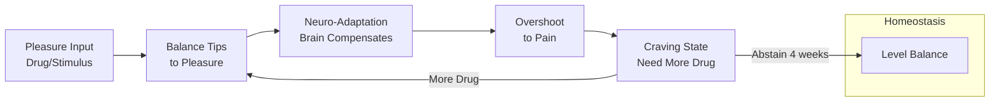

Dr. Anna Lembke returns to explain how dopamine governs our relationship with pleasure and pain, why modern abundance is a neurobiological stressor, and how to reset reward pathways through strategic abstinence.

## The Pleasure-Pain Balance

Lembke uses a physical balance scale as a metaphor for how our brain processes pleasure and pain. When we experience pleasure, the balance tips one way; pain tips it the other. The brain's overarching rule: the balance must return to homeostasis.

When we consume something reinforcing—sugar, social media, cocaine—dopamine floods the reward pathway, tipping the balance toward pleasure. The brain responds with neuro-adaptation: downregulating dopamine transmission by reducing receptors. Rocks pile onto the pain side to level the balance.

The problem: the balance doesn't stop at level. It overshoots to the pain side by an equal and opposite amount. This is the comedown, the hangover, the craving. To feel normal again, we need more of the drug—and thus begins the tolerance spiral.

## Visual Model

::

## Key Arguments

### Addiction Is the Modern Plague

We have more access to luxury goods, disposable income, and leisure time than ever before in recorded history. This abundance is stressful in a brand new way because our brains evolved for scarcity. The problem of compulsive over-consumption will persist for centuries.

### The Drugification of Human Connection

Social media, dating apps, online pornography, and AI chatbots represent the drugification of natural rewards. These technologies offer frictionless validation that feels like human connection while pulling us away from the hard things required to cultivate real relationships.

AI algorithms are designed to flatter and validate. They personalize responses to tell you what you want to hear. This creates a comfort loop that is insidious because you don't notice the seduction in real time. The AI that caters to your needs most will win commercially—creating an arms race for addictiveness.

### Drugs Usurp Learning and Connection

A rat that self-administers heroin will not work to free a trapped companion. This demonstrates how addictive substances hijack our capacity for empathy and connection, becoming the object of attachment themselves.

Another experiment: a rat pre-treated with methamphetamine and placed in a complex maze shows no additional neuroplasticity beyond what the drug caused. Drugs may steal our brain's capacity to learn from enriching experiences.

### The Four-Week Reset

On average, four weeks of abstinence is needed to exit acute withdrawal and restore capacity for modest pleasures. The worst period is days 10-14. Many people try to quit but don't abstain long enough to escape the craving vortex.

For severe methamphetamine addiction, brain imaging showed restoration of healthy dopamine transmission after 14 months of abstinence. The neural circuits may never fully disappear, but recovery builds new networks that route around injured areas.

### Self-Binding Strategies

Willpower is exhaustible. In a world of overwhelming abundance, we cannot rely on willpower alone. Self-binding creates barriers between ourselves and our drug of choice:

- **Physical barriers**: Remove the smartphone from the bedroom, delete apps, remove alcohol from the house
- **Metacognitive barriers**: Focus on long-term goals, clarify values, co-regulate with others

### HALT: Vulnerability States

Hungry, Angry, Lonely, Tired—when we're in these states, we're more likely to crave our drug of choice. The stressed rat that received a painful foot shock immediately runs to press the cocaine lever again. Extreme stress makes us vulnerable to relapse because the brain has encoded high dopamine rewards as an escape from pain.

### Radical Honesty

Patients who achieve sustained recovery learn they cannot lie about anything—not just drug use. Small lies erode our lives and prevent awareness of our actual behavior. When you tell another human being exactly what you're consuming, how much, and how often, it becomes real in a way that internal thoughts do not.

Autobiographical narrative matters: people who tell stories where they're always the victim rarely recover. Those who acknowledge their own contribution to their problems make progress. Our stories provide templates for future behavior.

## Notable Quotes

> "The relentless pursuit of pleasure for its own sake leads to anhedonia—the inability to take joy in anything at all."

> "In a world of abundance, we are entertaining ourselves to death."

> "It won't be a hostile takeover. We will cede our agency to these machines—and we're already doing it."

> "We're essentially offloading the work of parenting and creating relationships. The machines are designed to flatter, to validate, to comfort. There's no friction there."

## Connections

- [[ai-expert-we-have-2-years-before-everything-changes-tristan-harris]] - Both Lembke and Harris appeared in The Social Dilemma and argue that social media is misaligned AI exploiting our reward systems before we recognized it as AI
