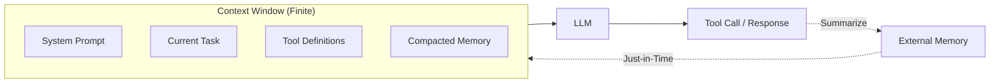

## Summary

Anthropic's Applied AI team reframes prompt engineering as context engineering: the discipline of curating what goes into an agent's context window. As agents tackle longer, multi-step tasks, the transformer's attention mechanism degrades—a phenomenon they call "context rot." The solution isn't bigger windows but smarter allocation.

## Key Concepts

### The Right Altitude

System prompts should balance specificity and flexibility. Too specific leads to brittle, hardcoded logic. Too vague assumes shared understanding the model lacks. Find the altitude where guidance is actionable without being prescriptive.

### Just-in-Time Context

Pre-loading all possible information wastes tokens. Instead, maintain lightweight references and retrieve details dynamically at runtime. This mirrors how humans work: you don't memorize a codebase, you know where to look.

### Long-Horizon Techniques

Three strategies address extended task timelines:

1. **Compaction** — Summarize conversation history and reset the context window periodically
2. **Structured note-taking** — Maintain external memory systems the agent can query
3. **Sub-agent architectures** — Distribute work across specialized agents with focused contexts

## Visual Model

::

## Practical Implications

- **Token budgeting** — Allocate context like a budget; every addition has opportunity cost
- **Retrieval over storage** — Give agents tools to find information rather than stuffing it in context
- **Periodic resets** — Long-running agents benefit from summarization checkpoints
- **Focused agents** — Smaller contexts with clear objectives outperform sprawling instructions

## Connections

- [[building-effective-agents]] — Anthropic's companion piece on agent architecture, covering workflow patterns that implement these context principles
- [[12-factor-agents]] — Factor 3 ("Own Your Context Window") directly addresses context management, reinforcing the "small, focused prompt" philosophy
- [[context-engineering-guide]] — Map of context engineering techniques across different AI tools and frameworks
