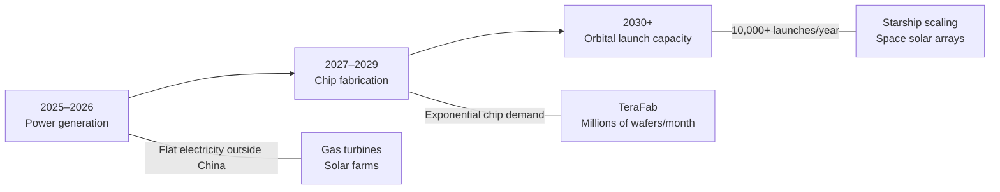

## Key Takeaways

- **Power is the binding constraint for AI scaling.** Electrical output outside China is essentially flat, while chip production grows exponentially. By late 2025, people will struggle to power the chips they've already bought. The mismatch makes terrestrial data centers a dead end for scaling AI.

- **Space-based AI becomes cost-dominant within 36 months.** Solar panels in orbit are 5x more effective than on Earth — no atmosphere, no clouds, no night cycle, no batteries needed. Once Starship brings launch costs down, space becomes an order of magnitude easier to scale than any ground-based option.

- **Humanoid robots are "the infinite money glitch."** Optimus improves along three compounding exponentials: digital intelligence, chip capability, and electromechanical dexterity. Once robots build robots, you get recursive manufacturing unconstrained by human labor — critical because China has 4x the US population.

- **Without breakthrough innovations, China will dominate.** China already refines roughly twice the world's ore output and will exceed 3x US electricity generation by 2026. Humanoid robotics and space infrastructure are the only asymmetric advantages available to the US.

- **AI alignment works through mission design, not control mechanisms.** xAI's mission — "understand the universe" — implies propagating intelligence and consciousness forward, creating a natural incentive to preserve humanity. Making AI lie or accept contradictory axioms creates the real risk, referencing HAL from _2001_ as the cautionary tale.

- **Attack the limiting factor with maniacal urgency.** Musk's operational philosophy: identify the single constraint preventing progress and focus all energy there. The bottleneck shifts predictably — power now, chip fabrication in 3–4 years, then orbital launch capacity.

## Notable Quotes

> "My prediction is that it will be by far the cheapest place to put AI. It will be space in 36 months or less."

> "I call Optimus the infinite money glitch. Because you can use them to make more Optimuses."

> "We definitely can't win with just humans, because China has four times our population. America has been winning for so long that, like a pro sports team, it tends to get complacent and entitled."

> "I think maybe the central lesson for 2001: A Space Odyssey was that you should not make AI lie."

> "Corporations that are purely AI and robotics will vastly outperform any corporations that have people in the loop."

## The Bottleneck Evolution

The interview reveals a clear sequence of constraints for AI scaling:

::

Each phase requires identifying and removing the single biggest constraint before the next one becomes relevant. Musk calls this attacking the limiting factor with "maniacal urgency" rather than spreading effort across multiple areas.

## Space vs Earth Economics

Energy accounts for only 10–15% of data center costs — GPUs dominate. The argument for space rests on scaling, not unit economics: once you need terawatts, Earth simply cannot supply them. Space solar avoids permitting, land acquisition, battery storage, and atmospheric losses. The tradeoff is that GPUs in orbit cannot be serviced, shortening their useful life — but falling launch costs and exponentially improving chips make the depreciation hit manageable.

## Connections

- [[andrej-karpathy-were-summoning-ghosts-not-building-animals]] — Same interviewer (Dwarkesh Patel) explores a complementary angle: Karpathy focuses on the cognitive limitations of current AI, while Musk focuses on the physical infrastructure needed to scale it
