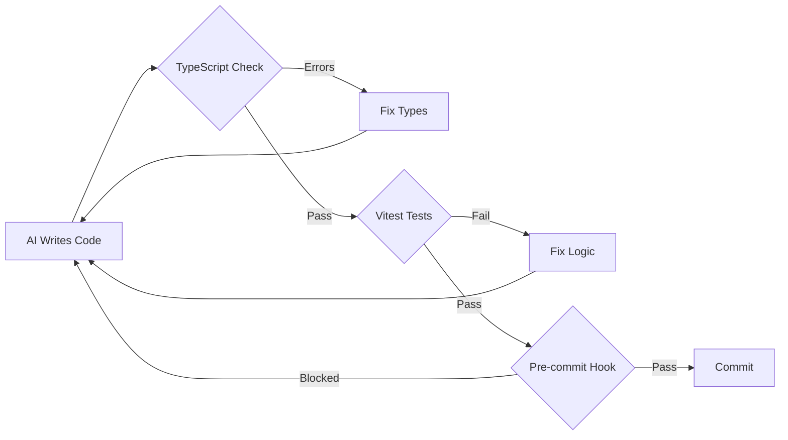

When AI coding agents operate independently, they need mechanisms to verify their own work. Matt Pocock outlines three essential feedback loops for TypeScript projects.

## The Core Problem

AI agents working AFK (away from keyboard)—like those using the Ralph Wiggum technique—can't test changes in a browser. They need automated feedback to catch errors before they compound.

## Three Feedback Loops

### 1. TypeScript Over JavaScript

TypeScript provides free feedback. Type errors surface problems the AI would never find without manual browser testing. The type system acts as a constant sanity check on the agent's work.

### 2. Vitest for Logic Errors

Types catch structural mistakes but miss logical ones. A test framework like Vitest fills this gap. Basic unit tests covering core functionality keep the AI on track when reasoning fails.

### 3. Husky Pre-commit Hooks

Husky enforces these feedback loops before every commit. The agent cannot push broken code—it must fix issues first.

```bash
# Install and initialize Husky
npx husky init

# Create pre-commit hook
echo "pnpm typecheck && pnpm test" > .husky/pre-commit
```

## Feedback Loop Diagram



::

## Connections

- [[ralph-guide]] - The Ralph Wiggum technique relies on these feedback loops to run AI agents autonomously overnight
- [[vue3-testing-pyramid-vitest-browser-mode]] - Both emphasize Vitest as critical infrastructure for AI-assisted development
