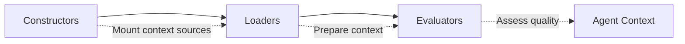

## Summary

This paper argues that managing external knowledge and information—context engineering—matters more than model fine-tuning for building effective AI systems. The authors propose treating context like files in Unix: a uniform abstraction that handles mounting, metadata, and access controls for diverse context sources.

The AIGNE framework implements this philosophy through a three-stage pipeline that emphasizes human oversight and accountability.

## The AIGNE Pipeline

The framework processes context through three distinct stages:

::

- **Constructors** - Mount various context sources (documents, APIs, databases) using consistent interfaces
- **Loaders** - Transform and prepare context for consumption, handling metadata and access controls
- **Evaluators** - Assess context quality and relevance before injection into agent workflows

## Core Insight

The Unix philosophy "everything is a file" provides a blueprint for context management. Just as Unix abstracts hardware devices, pipes, and files behind a uniform interface, AIGNE abstracts RAG pipelines, memory stores, tool outputs, and user inputs behind consistent mounting and access patterns.

This abstraction enables:

- **Composability** - Mix and match context sources without rewriting agent logic
- **Traceability** - Track which context influenced which decisions
- **Access control** - Apply permissions to context sources, not just model capabilities

## Applications

The paper demonstrates two practical implementations:

1. **Memory-equipped agents** - Persistent context that survives across sessions
2. **GitHub assistants** - Repository context mounted and queried through the file system abstraction

## Connections

- [[ai-engineering]] - Chip Huyen's book covers RAG and context management as core AI engineering skills; this paper proposes infrastructure-level abstractions for those techniques
- [[how-to-build-a-coding-agent]] - The agent loop described by Geoffrey Huntley allocates results back to context—AIGNE provides a formal model for that context management
