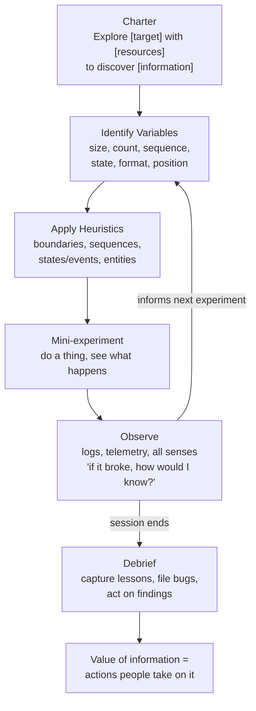

## Why I saved this

The default story in 2026 is "AI writes the tests for you." That story works for _checks_ — the regression net Hendrickson is contrasting against. It does almost nothing for the bug class she's actually talking about: privilege escalation through a multi-select UI, payment flows that hold rejected state forever, race conditions that only show up on real users. Those bugs survive because nobody knew to write the assertion.

The talk is a 2024 video by the author of _Explore It!_ — the discipline isn't new, but watching it now reframes a lot of the AI-testing discourse. Counter-point to [[software-testing-with-generative-ai]]: Winteringham says AI gives exploratory testing a partner. Hendrickson is more pointed — exploration is _the part of the job that requires a mind_, and the mind needs a method.

## Core argument

> "Something isn't tested until it is both checked and explored."

Checks verify expectations you already have. Exploration discovers surprises — capabilities and limitations the team never thought about. They answer different questions, so neither replaces the other. A safety net of unit/integration/E2E tests still has holes; the goal of exploratory testing is to find the bugs that survive the net.

## The method (not random clicking)

Exploratory testing is **simultaneously designing and executing tests, using insight from each experiment to inform the next.** Run it in chartered sessions of half a day to a day:

The **charter** is a one-line goal: _Explore [target] with [resources] to discover [information]._ It can be drafted right before a session or brainstormed as a backlog the whole team draws from between coding tasks.

## Bug Hall of Fame (why this matters)

Three bugs that escaped a tightly-woven net and were only caught by exploring:

- **"Your money is no good here"** — In a SaaS payment flow, if a credit card was rejected for _any_ reason (even a ZIP-code validation miss), the software held that rejection state forever. The customer could never pay again. Found by varying _sequences_ of credit-card events.
- **"Grant yourself privileges"** — Strict XP team, rock-solid RBAC. But on the user's own profile page, the multi-select of "your roles" was editable. A read-only user could pick "super admin" and save. Privilege escalation. Found by exploring the _interaction_ of two features that had each been tested in isolation.
- **"Zombie process land"** — Agent-based chat. If a user disconnected while in a hold queue, the session became a zombie that nobody could close. Eventually the system fills with them. Found by **model-based test automation** walking state combinations — Hendrickson's pointed reminder that exploration is a mindset, not a manual activity.

The pattern in all three: no pre-written test list would have asked the right question.

## Heuristics — pre-loaded test design strategies

Exploration without test-design grounding _is_ random clicking. The talk lists four heuristic families:

- **Boundaries / constraints** — too big, almost too big, exactly the limit, reserved characters, zero, one, negative, off-by-one. ("A tester walks into a bar and orders zero beers, .98 beers, 999999 beers, -1 beers.")
- **Sequences** — skip steps, reverse, undo/redo, loop the same action many times, synchronize two operations to fire at the same instant.
- **States and events** — anywhere you can say "**while** X is happening" you've found a state. Then interrupt it (logoff, hibernate, time out, cancel) or trigger another long-running state to overlap with it.
- **Entities and relationships** — CRUD every entity, vary counts on dependencies (zero payments, one payment, many), violate dependencies (an invoice with no customer), follow data through its full lifecycle (save → import → export → search).

## The two stories I keep thinking about

**Mars Rover Spirit (2004).** Rebooted forever en route to Mars. Not because of disk space — because of _number of files_ on the flash drive, which exceeded what working memory could load on boot. Variables are fractal: every entity has its own attributes worth varying. Disk has bytes _and_ file-count _and_ permissions _and_ format. Hendrickson's takeaway: "Exploratory testing is about navigating towards risk." The job is choosing which variables matter, not enumerating all of them.

**The system monitor crash that shipped.** Two parallel processes — a system monitor writing to a local DB, and an updater pulling new rules that needed an exclusive lock. In the lab, both states were short; collisions were rare and uncatchable. So the team shipped. In production, every new user spent _much_ longer in both states (full-machine inventory + full rule download), and collision odds were ~100%. The bug worked exactly as designed — the lab's _state durations_ didn't match production's. The lesson Hendrickson drilled in: when you analyze states, also analyze _how long the system stays in each state_ and how that changes for real users.

## Observing is the hard part

> "Where you choose to look is going to have a huge effect on what you find."

The installer story: all install tests passed because they only checked for errors during install. Nobody ever ran the software afterward. Tech support called the day they got a build — key files were missing entirely. Confirmation bias dressed up as testing.

The corrective question she keeps coming back to: **"If something were going wrong, how would I know?"** Use everything — logs, telemetry, monitors, even sound (a drive spinning up). And actively try to disconfirm the assumption that things are fine.

## Who and when

> "When? Always. Who? Everyone."

A designated explorer is a single point of failure. The team needs the _mindset_ widely available, not concentrated in one person. And there is no "too early" — Hendrickson once joined a project on day two, explored the scaffolding, and killed an entire bug class before it could reproduce. You can even explore _requirements_ and _designs_ before code exists.

## Exploring is learning

The talk closes by mapping the exploratory loop onto **Kolb's experiential learning cycle** (experiment → observe/reflect → abstract → next experiment). They are the same shape. This is the mental model worth pulling forward into AI-augmented development: every prompt-and-evaluate loop is also an exploration loop. The discipline of charter → variables → heuristics → observe → debrief is portable to how you'd run an LLM through an unfamiliar codebase or a new agent skill.

## Practical takeaways

1. Run **chartered exploratory sessions**. Write the charter (target / resources / information sought) before you start, debrief at the end.
2. Hunt **subtle variables**, not form fields. Size, count, format, sequence, state, attributes.
3. Use **"while"** as a state-detector — then interrupt or overlap the state.
4. Always ask: **"If this were going wrong, how would I know?"**
5. Make exploration a **whole-team practice** — not a job title. Pair an explorer with a developer; bugs found in the morning can be fixed the same afternoon.

## Connections

- [[software-testing-with-generative-ai]] — Winteringham frames AI as a partner _for_ exploratory testing. Sit with the tension: he's more optimistic about LLM-aided exploration than Hendrickson's "exploration is a mindset" framing implies. The combined view: AI can scale checks and even generate exploration _ideas_, but the steering — variable choice, observation, debrief — is still the human's job.
- [[the-testing-pyramid-is-dead]] — Both arguments converge on the same point: there is no universal testing strategy, and the shape of your test suite should match the shape of your risk. Hendrickson's "navigate towards risk" is the same instinct from the explorer's chair.
- [[autonomous-qa-testing-ai-agents-claude-code]] — A practical counterpoint: OpenObserve built specialized Claude sub-agents that found a silent production bug nobody had reported. That's exploratory testing done by AI, exactly the "model-based automation" Hendrickson hints at with the zombie-session story.
- [[write-tests-not-too-many-mostly-integration]] — Dodds' testing trophy is the "checks" half of the equation. Read together, the two pieces split testing cleanly: structured assertions for what you expect, exploration for what you don't.
