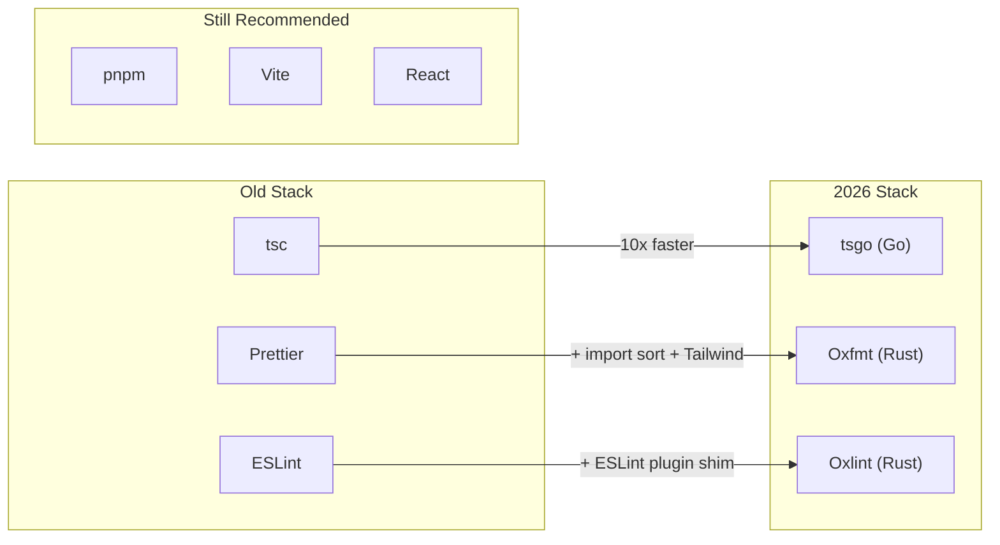

Christoph Nakazawa — the person behind Jest, Metro, and years of JavaScript infrastructure at Meta — makes a simple claim: 2026 is the first year you can swap out the slow JavaScript tooling for dramatically faster alternatives without giving anything up. No compromises. That's new.

The article reads like a field report from someone who's actually migrated 20+ projects, not a hype post from someone who tried a tool for a weekend.

## The Replacements

::

**tsgo** — TypeScript rewritten in Go. 10x faster type checking, and it actually caught type errors the original `tsc` missed. After 20+ projects from 1K to 1M lines, Nakazawa considers it production-ready. The migration path: switch to tsdown or Vite first, then swap `tsc` for `tsgo`.

**Oxfmt** — Replaces Prettier for JS/TS with built-in import sorting and Tailwind class ordering. Falls back to Prettier for non-JS languages, so you lose nothing in the transition.

**Oxlint** — The breakthrough here is the ESLint plugin shim via NAPI-RS. Previous Rust linters couldn't run the existing ESLint ecosystem's plugins — Oxlint can. That was always the dealbreaker, and it's gone.

## The Linting Philosophy

Nakazawa's `@nkzw/oxlint-config` encodes five principles worth stealing:

1. **Error, never warn** — Warnings are noise. Either enforce the rule or remove it.
2. **Strict, consistent style** — Modern patterns enforced, not suggested.
3. **Prevent bugs** — Ban `instanceof`, block `console.log` and `test.only`.
4. **Performance** — Avoid slow rules. Use TypeScript's `noUnusedLocals` instead of the ESLint equivalent.
5. **Minimize friction** — Drop subjective rules. Prioritize autofixable checks.

The interesting validation: GPT 5.2 Codex performed measurably better migrating code inside a project with these strict guardrails. Tighter constraints made the AI produce better output. This tracks with the emerging pattern that LLMs thrive under strict, locally-reasoned rules rather than loose guidelines.

## What Stays

pnpm, Vite, and React all survive the purge. Nakazawa calls pnpm the superior package manager (no argument there). Vite remains unmatched for stability and extensibility. React stays because React Compiler and Async React make it worth the ecosystem lock-in.

## Notable Quotes

> "JavaScript tools need to be fast, stable, and feature-complete. There have been many attempts in recent years to build new tools, but they all required compromises. With the new tools above, you won't have to compromise."

## Connections

- [[vite-rust-and-the-future-of-javascript-tooling]] — Same thesis from a different angle: Rust-based tools are rewriting the JS ecosystem's foundation, and Vite sits at the center of both conversations.
- [[a-language-for-agents]] — Armin Ronacher argues the winning languages will optimize for machine readability. Nakazawa's finding that strict linting makes AI code better is concrete evidence for that claim.
