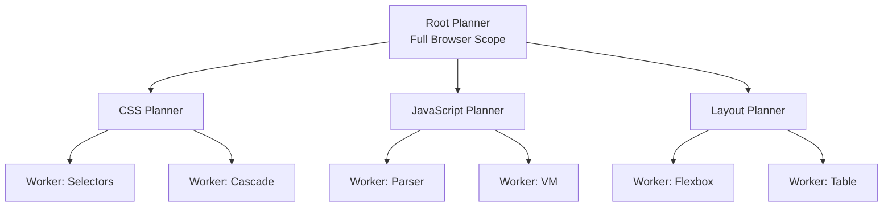

Wilson Lin, a product engineer at Cursor, built FastRender—a functioning browser rendering engine—using swarms of thousands of parallel AI coding agents. What started as a personal experiment to test Claude Opus 4.5 and GPT-5.1's capabilities on complex tasks evolved into Cursor's research project on scaling autonomous coding agents.

## Key Takeaways

- **2,000 agents running concurrently** produced thousands of commits per hour, generating over 30,000 commits and a million+ lines of Rust code
- The system ran autonomously for a full week with no human intervention once started
- Agents used GPT-5.2 (general model, not Codex) because the instructions required understanding general autonomous operation, not just coding
- Simple context management—just a scratch pad file that agents update frequently—enabled agents to run for hours across thousands of turns

## The Planner-Worker Architecture

FastRender uses a hierarchical tree of planners and workers:

::

- **Planners** own a scope and can delegate to sub-planners or workers
- **Workers** execute specific tasks within narrow boundaries
- When agents finish, they provide a handoff to their parent planner, enabling dynamic response to progress or regressions
- The system naturally divides work to minimize merge conflicts—most commits don't touch the same files

## Feedback Loops Are Essential

Without feedback mechanisms, agents drift and produce worse code over time. FastRender used several grounding techniques:

- **Specifications as context** — CSS, HTML, and WebAssembly specs included as git submodules that agents reference continuously
- **Visual diffs** — Models look at rendered screenshots and compare against golden samples
- **Compilation as feedback** — Rust's strong type system catches errors quickly, providing fast iteration signals
- **Aggressive timeouts** — Forces agents to write performant code or they can't proceed

## Emergent Behaviors

The agents exhibited surprisingly human-like coordination:

- One agent pulled in QuickJS (a JavaScript engine) as a dependency, explicitly noting that "other agents are working on the JavaScript engine" and it needed to unblock itself—planning to remove it once the proper engine was ready
- Feature flags appeared organically when agents decided to disable incomplete JavaScript support
- Errors don't accumulate—they fluctuate at a stable rate, getting introduced and fixed quickly as agents work in parallel

## The Instruction Problem

Wilson emphasized that agent behavior directly reflects instruction quality. Early runs produced suboptimal results because instructions didn't specify which dependencies agents should implement themselves versus pull from external libraries. Once clarified, agents built the core systems (JS VM, DOM, paint, text pipeline) from scratch.

> "It's not that the agents are doing something wrong—they're obeying instructions rigorously. The errors are usually in what you overlooked when writing the instructions."

## Notable Quotes

> "The biggest surprise was how capable these agents are at this point. Single agents running for hours, holding context, knowing when to stop."

> "It was surprising that a few hundred or thousand agents concurrently can work together and produce code that is 99% compilable and mostly aligned to your instructions."

## Connections

- [[how-to-build-a-coding-agent]] — FastRender scales the same agent loop (query → inference → tool → context) from single-agent to thousands working in parallel
- [[agentic-design-patterns]] — FastRender implements multi-agent collaboration patterns: hierarchical planning, task delegation, and the reflection/feedback loops that enable self-correction
