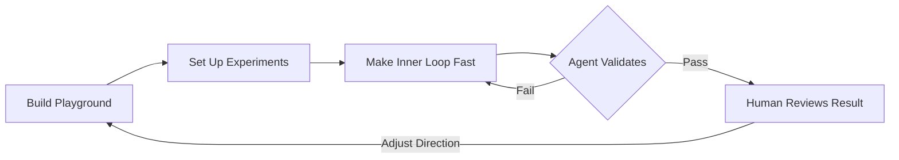

## Summary

Lewis Metcalf argues that the digital world was built for humans—visual interfaces, animations, interactive elements—but AI agents work best with text-based feedback loops. Making problems "feedback loopable" means restructuring your environment so agents can validate their own solutions while humans provide high-level guidance rather than step-by-step control.

## Key Concepts

### Three-Part Methodology

**1. Build a Playground** — Create environments where both human and agent can explore a problem systematically. Convert dynamic systems (animations, interactive UIs) into static representations an agent can analyze. A physics simulation becomes a rendered snapshot. A dashboard becomes a URL-driven state.

**2. Set Up Experiments** — Make simulations adjustable and reproducible through URL parameters. Encoding state in the URL lets both parties share exact scenarios, replay edge cases, and verify fixes deterministically.

**3. Make the Inner Loop Fast** — Implement headless CLI tools that give agents instant feedback without browser overhead. Let agents output data in formats they prefer (text, structured logs) and modify those formats as debugging needs evolve.

### The Collaboration Model

Metcalf shifts from "leave the agent alone" to a collaborative relationship: humans give high-level validation and direction, agents execute and verify. The key insight is that agents independently modified CLI output formats and requested specific data (position deltas, velocity changes) without being told to—they adapted their own feedback loop.

## Code Snippets

### Headless CLI for Agent Debugging

A CLI tool lets an agent run frame-by-frame physics simulation without a browser, outputting text data it can reason about directly.

```javascript
#!/usr/bin/env npx tsx

// CLI to debug physics simulation
// Usage: npx tsx physics-cli.ts --vx=-7.71 --vy=2.13 --frames=50

import { Physics, type Ball } from './physics.js'

const args = process.argv.slice(2)
const centerX = 250
const centerY = 250

let ball: Ball = {
  x: centerX,
  y: centerY,
  vx,
  vy,
  radius: 12,
}

for (let i = 0; i < frames; i++) {
  ball = Physics.step(ball, centerX, centerY, gapAngle)
}
```

### ASCII Widget Rendering

Agents can test UI components through text-based rendering rather than screenshots.

```bash
$ widget-cli static \
    --path framework/widgets/text-field \
    --class TextField \
    --props '{"placeholder": "Type here"}'

╭──────────────────────────────────────────────────╮
│╭────────────────────────────────────────────────╮│
││ Type here                                      ││
│╰────────────────────────────────────────────────╯│
╰──────────────────────────────────────────────────╯
```

## Visual Model

The feedback-loopable workflow converts human-centric interfaces into agent-consumable feedback loops.



::

## Connections

- [[vibe-driven-development]] — VDD's "Radical Transparency" pillar maps directly to feedback-loopable design: both argue that making system state visible and testable is the foundation for productive human-agent collaboration
- [[unrolling-the-codex-agent-loop]] — Metcalf's "inner loop" optimization complements Bolin's analysis of agent loop architecture: faster feedback loops reduce the cost per iteration in the same tool-call cycle Bolin describes
- [[pi-coding-agent-minimal-agent-harness]] — Zechner's "stay out of the way" philosophy aligns with Metcalf's approach of setting up the environment and letting the agent explore independently
