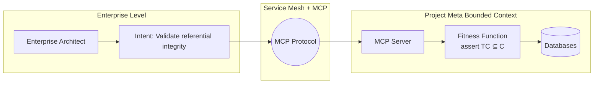

Enterprise architects have wanted holistic governance for years—fitness functions that validate architectural properties across their entire ecosystem. The problem: implementation details. To check referential integrity between databases, you need to know which databases, what schema, how they communicate. When implementations change, governance breaks. MCP changes this equation.

## The Meta Bounded Context Problem

Projects have a _meta bounded context_—the specific implementation details of how they've built their systems. Database types, communication protocols, service boundaries. Enterprise architects sit far away from these details, and any governance code they write must pierce this boundary.

This piercing creates brittleness. When the project team changes their database schema or adds a new service, the enterprise-level fitness function breaks—not because the architecture is wrong, but because implementation details shifted. After enough false failures, architects abandon the tooling entirely.

## MCP as the Solution

MCP acts as an integration layer that separates intent from implementation:

1. **Enterprise architect states intent**: "Validate referential integrity between databases"
2. **Project exposes MCP server**: Inside the meta bounded context, with implementation knowledge
3. **Service mesh coordinates**: Routes the intent to the right project-level tool
4. **Implementation changes stay local**: The project team updates their MCP server; the enterprise rule remains unchanged

The enterprise architect never writes `assert TC ⊆ C`. They say "validate referential integrity" and the project's MCP server translates that to concrete checks against their specific databases.

## Visual Model



::

## Architecture as Code

The broader vision: treat your software development ecosystem as a codebase. Define architectural rules in pseudo-code, then generate concrete fitness functions for each technology stack.

```text
DEFINE DOMAINS: [customer, order, ticket]
DEFINE RELATIONSHIPS: customer -> order, order -> ticket
ASSERT: classes ONLY IN declared domains
```

Hand this to an LLM, specify "Java" or ".NET" or "Go", and it generates the appropriate ArcUnit/NetArchTest/ArchGo fitness functions. The rules live in one place; implementations multiply across the ecosystem.

## Key Insight: Normalized Distance from Main Sequence

Looking for a metric that detects AI-generated code quality issues? Normalized Distance from Main Sequence identifies code built by brute force—lacking abstraction, heavy on implementation details. It's the single most useful metric for spotting "AI slop" in your codebase.

## Practical Takeaways

- Wire fitness functions into CI to enforce architectural rules automatically
- Use tools like ArcUnit (Java), NetArchTest (.NET), PiestArc (Python), ArchGo (Go) for code-level checks
- For distributed architecture checks, write small scripts that aggregate data from logs and monitoring
- Let MCP bridge the gap between enterprise intent and project implementation
- Define architecture rules once, generate concrete checks for each tech stack

## Connections

- [[building-evolutionary-architectures]] — Ford's earlier talk covering the foundation of fitness functions; this talk extends those concepts to enterprise scale with agentic AI
- [[building-evolutionary-architectures-book]] — The book where Ford and colleagues originally defined architectural fitness functions in 2017
- [[architecture-fitness-functions-at-scale]] — Swissquote's real-world implementation of fitness function governance across 1000+ applications
