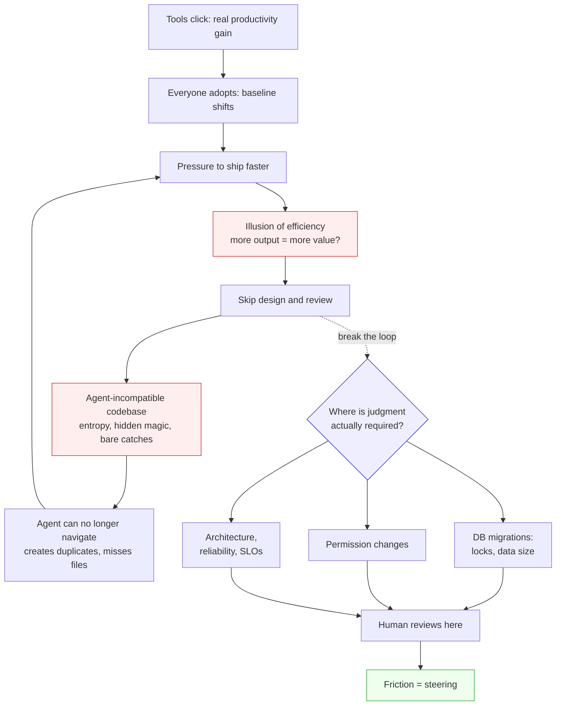

## Overview

Ronacher and Poncela Cubeiro have been shipping agent-built software at Earendil for 12 months. Their argument: the marketing slogan "ship without friction" is the exact failure mode to avoid. Friction is not overhead — it's the physical mechanism by which judgment enters the system. Remove it and you lose steering.

The talk splits the problem in two: a psychology problem (why humans can't slow down even when told to) and an engineering problem (why codebases decay when agents write most of the code). Both converge on the same answer — design deliberate re-entry points where the human has to think.

## Key Arguments

### The efficiency illusion

Ronacher is blunt: agents make you feel more productive because output volume goes up, not because you're solving the right problem. The flow state is seductive — one more prompt, one more PR — and there's no natural stopping point. The baseline moves fast: what was "a 10x productivity gain" in month one becomes "the expected pace" in month six, with no time budget left for thinking or design.

Poncela Cubeiro, who calls herself a "native AI engineer" because these tools predate her career, adds the sharper framing: when you're in the flow, _you_ can't stop, and the agent definitely can't — it's "running around reading files it should have never read." Agency has to come from outside the loop.

### Agents optimize for "make progress," not "good code"

The reinforcement learning objective is: write code, run tests, unblock yourself. That means agents silently paper over failure modes a human engineer would feel embarrassed to commit — config defaults that swallow missing files, try/catch blocks that hide errors, fallback state that masks broken inputs. The code runs. The system hobbles. Two hours later you discover you've written rows with the wrong data.

> "Humans feel bad and agents don't really have any emotions that they communicate to you."
> — Armin Ronacher

That emotional signal — the cringe before committing something you know is wrong — is the quiet steering mechanism that's been holding codebases together. Agents don't have it. Which means the codebase entropy accumulates faster than any human-only codebase would, and eventually the agent itself can't navigate what it built.

### The production/review imbalance reshapes the team

Code creation used to be the supply constraint. Now it isn't — and the rest of the org's shape was calibrated for the old constraint. Every engineer produces far more than they can review. PRs pile up. Rubber-stamping replaces actual review. Worse, the pool of people shipping code expands to include marketing, ex-CEOs, non-engineers — but the _responsibility_ pool doesn't expand with it. The number of entities that can carry accountability no longer matches the number shipping.

### Libraries thrive, products suffer

A tight observation that matches what the authors see in practice:

- **Libraries** have clearly scoped problems, tight API surfaces, a single simple core. Agents excel — the constraints are the specification.
- **Products** have UI × API × permissions × feature flags × billing, all intertwined. None of it fits in a context window. Locally the agent is reasonable; globally it goes "a bit demented."

The fix isn't a smarter agent. It's treating your codebase as infrastructure that must be legible to the agent.

### The agent-legible codebase

Concrete Earendil practices, most enforced by linting:

- **No bare catch-alls** — agents love to swallow errors to "make progress"
- **One SQL query interface** — so the agent can't miss a call site when refactoring
- **One UI primitives library** — no raw `<input>` elements, consistent styling, one kind of behavior
- **No dynamic imports** — static graphs the agent can actually read
- **Unique function names** — grep returns one result, loop stays tight, token-efficient
- **No hidden magic** — React Server Actions, ORMs hide intent; if the agent can't see it, it can't respect it
- **Erasable-syntax-only TypeScript** — code is JS with type annotations; one source of truth between code and compiler so the agent isn't confused by transpilation

The throughline: lean into the RL the models were trained on (common patterns, standard libraries, simple cores) instead of fighting it with clever abstractions.

### Mechanical bugs vs. judgment calls — the Pi review split

The most actionable piece of the talk is their review tool. Earendil built a Pi extension that splits review feedback into two piles:

1. **Mechanical issues** — AGENTS.md violations, obvious bugs. "Fix all issues" sends these back to the agent, which acts automatically.
2. **Human judgment calls** — database migrations (lock behavior, data size), permission changes (underdocumented, easy to miss), new dependencies (do I trust the maintainer?), architecture and reliability.

The separation is the point: the mechanical bucket preserves the speed of agent loops; the judgment bucket wakes the human up _exactly_ when their brain is the differentiator. Miss it and you regret it. You will miss it. So let the machine flag where to look.

### Friction as steering — the SLO analogy

The closing move reframes friction. Good engineering teams have always had intentional friction: SLOs, change windows, migration checklists. Not bureaucracy — forcing functions. They make you ask: _do I need this reliability? Am I staffed for this criticality?_

> "Without friction there's no steering."
> — Armin Ronacher

Agent tooling promises to remove all friction. That's the dangerous part. You want the fast path for reproduction cases and product exploration. You want the slow path, with full human attention, for system architecture, reliability, and anything that writes to production data.

## Notable Quotes

> "Would it be that hard if the machines would actually be writing perfect code and we wouldn't have to think quite as much?"
> — Armin Ronacher

> "Locally the agent tends to be very reasonable but when it gets to the global scale it becomes a bit demented."
> — Cristina Poncela Cubeiro

> "We forget that we producing months and months of technical debt in the time of weeks, in a time of days sometimes."
> — Armin Ronacher

## Practical Takeaways

- Build mechanical enforcement before you scale agent usage — linting rules, single query interfaces, unique function names, flat dependency graphs. The codebase design _is_ the agent harness.
- Separate review into mechanical (agent-fixable) and judgment (human-only) before the PR volume breaks you. Don't rely on willpower to notice which PR needs thinking.
- Treat DB migrations, permission changes, dependency adds, and architecture as explicit friction points. The agent should never be allowed to glide through these.
- Audit your stack for hidden magic. If an ORM or framework hides intent, the agent can't respect what it can't see — and neither can the human reviewer an hour later.
- Notice when the pressure to ship is actually a baseline shift, not a deadline. The "expected pace" is the trap.

## Connections

- [[pi-coding-agent-the-best-alternative-to-claude-code]] — the Pi extension Ronacher mentions for splitting mechanical vs judgment review is the same agent Etisha Garg walked through; now there's a product argument for _why_ the harness has to be customizable.
- [[dhhs-new-way-of-writing-code]] — DHH's bet that taste is the new bottleneck and this talk's claim that judgment is where friction belongs are two sides of the same shift; DHH runs 12 agents in parallel, Ronacher and Poncela Cubeiro explain which 12 moments must still be slow.
- [[the-wet-codebase]] — Abramov's "inline first, abstract later" and the agent-legible codebase share the same root: simple, flat, obvious code survives change better than clever code, and now the non-human reader is also a reason.
- [[biggest-problems-of-ai]] — a new entry for that synthesis: the productivity illusion as a first-order safety problem, not just a taste problem.
