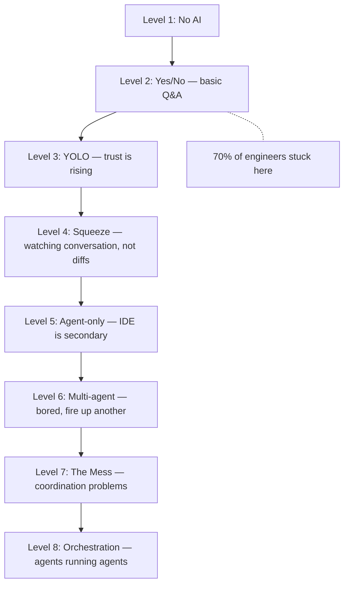

## Timestamps

| Time  | Topic                                                                                         |
| ----- | --------------------------------------------------------------------------------------------- |
| 0:00  | Intro — Steve's 40-year career, Amazon/Google, Gas Town, Vibe Coding book                     |
| 2:00  | Blog posts & career reflections — "Execution in the Kingdom of Nouns," "Rich Programmer Food" |
| 8:00  | Walking up the abstraction ladder — required knowledge shifts every few years                 |
| 12:00 | AI skepticism to belief — from ChatGPT 3.5 to Claude Code                                     |
| 17:00 | The 8 levels of AI adoption — full walkthrough                                                |
| 22:00 | The IDE debate — death of the IDE, Claude Co-Work, token burn                                 |
| 28:00 | Gas Town architecture — orchestrators, mayor/crew/polecats, minimax context                   |
| 38:00 | Monoliths vs. AI-friendly codebases — context window ceiling                                  |
| 40:00 | The vampiric effect — burnout, 3 productive hours, value capture                              |
| 50:00 | Big companies are dying — innovation from the fringes, small teams                            |
| 55:00 | Heresies in vibe-coded codebases — recurring architectural errors agents propagate            |
| 62:00 | Personal software & the fork economy                                                          |
| 68:00 | Languages, debugging, developer workstations                                                  |
| 72:00 | Grief and identity — five stages of grief for craft-oriented engineers                        |

## The 8 Levels of AI Adoption

Steve's framework for where engineers sit with AI tools. His claim: 70% are stuck at levels 1-2.

::

The jump from level 6 to 7 is where things break — you accidentally text the wrong agent, changes conflict, coordination falls apart. That's exactly the problem Gas Town (Steve's open-source orchestrator) tries to solve. The pattern: completions → chat (completions in a loop) → agents (chat in a loop) → orchestrators (agents in a loop).

## Key Arguments

### The Abstraction Ladder Never Stops

Steve's 40-year view: what engineers "need to know" keeps shifting upward. Assembly → compilers → high-level languages → distributed systems → AI. He watched graphics go from pixel-plotting to game-world physics in a decade. The same compression is happening to software engineering now. His own ego was wrapped up in compiler knowledge — and he had to let it go.

### Big Companies Are Quietly Dying

Google hasn't produced organic innovation since ~2008 (only acquisitions). When a company has more people than work, politics and empire-building kill creativity. Steve's prediction: AI-enabled teams of 2-20 people will rival or exceed the output of large enterprises. "We're all looking at the big dead companies. We just don't know they're dead yet."

### The Vampiric Effect Is Real

AI makes you extraordinarily productive but drains System 2 thinking at an unsustainable rate. You might get 3 genuinely productive hours at max vibe coding speed — and still produce 100x output. The question becomes: who captures the surplus? If companies demand 8-hour days at AI speed, people break. Steve wrote a whole article about this — [[the-ai-vampire]] expands on the economics and the pushback strategies.

### Monoliths Are Incompatible with AI Development

The ceiling for what agents can productively build is between 500K and 5M lines of code — and rising. Enterprise monoliths with hundreds of millions of lines will never fit in a context window. Companies must break them up or consider rewriting from scratch, which is now becoming faster than incremental migration.

### "Heresies" Are the New Tech Debt

In vibe-coded codebases where humans don't read the code, agents can propagate incorrect architectural decisions. Steve calls them "heresies" — they spread, recur even after removal (a single stale doc reference can resurrect them), and must be explicitly guarded against in system prompts. This connects directly to the bitter lesson: don't try to be smarter than the AI, but you still need to constrain it.

## Notable Quotes

> "I along with everyone else went 'no, it's not' — just flat-out rejection, absolutely not happening — until I used it and then I was like, 'Oh, I get it. We're all doomed.'"
> — Steve Yegge on first using Claude Code

> "You might only get three productive hours out of a person at max vibe coding speed, and yet they're still 100 times as productive as they would have been without AI. So, do you let them work for 3 hours a day? And the answer is, yeah, you better, or your company's going to break."
> — Steve Yegge

> "We're all looking at the big dead companies. We just don't know they're dead yet."
> — Steve Yegge on big tech innovation

> "I was checking off things that no longer mattered that I had really cared about — my ability to memorize, my ability to write, my ability to compute... the world goes monochrome, all color disappears."
> — Steve Yegge on the grief of losing craft identity

## Predictions

- **~50% of engineers at big companies will be cut** — companies set a dial, shed half their engineers to fund AI tokens for the remaining half
- **Programming by talking to a face by end of 2025** — most people will program by speaking to an AI avatar rather than typing
- **Non-technical family members as top contributors by summer 2027** — Steve predicts his wife will be the top contributor to their game project
- **At least two more capability cycles remain** — models will become at least 16x smarter than current state
- **Gas Town itself will be obsolete in ~6 months** — the orchestrator shape that works now won't be the shape that works in mid-2026

## The Minimax Context Argument

Two opposing schools Steve identifies: **Maximizers** fill the context window with rich context for wise responses. **Minimizers** want shortest possible windows to avoid quadratic cost increases and cognition drop-off. Gas Town uses both — "crew" roles for max context (design discussions) and "polecats" for min context (well-specified subtasks).

## Connections

- [[the-ai-vampire]] — Steve's own article expanding on the vampiric burnout effect he discusses here, with the economics of value capture between employers and employees
- [[2026-the-year-the-ide-died]] — Steve's talk at AI Engineer 2025 making the same case about IDE death and agent swarms, now elaborated with the 8 levels framework
- [[boris-cherny-creator-of-claude-code-pragmatic-engineer]] — Same podcast, Boris built the tool that Steve says changed his mind about AI coding ("until I used it and then I was like, oh, we're all doomed")
- [[from-tasks-to-swarms-agent-teams-in-claude-code]] — Alexander's practical experience with multi-agent coordination maps directly to Steve's levels 6-8 and the "mess" problem orchestrators solve
