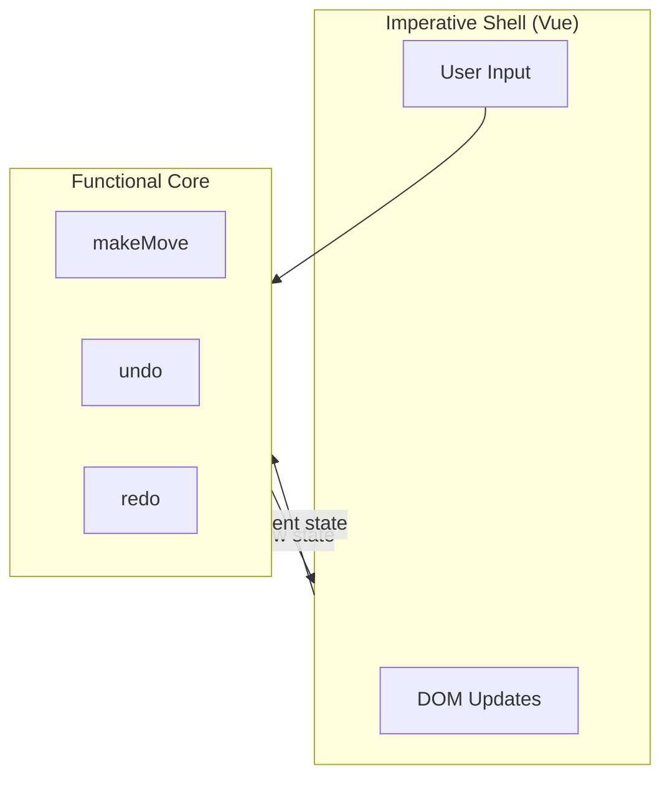

## Key Takeaways

- **Separate business logic from UI logic** — The functional core contains pure functions that transform data; the imperative shell handles DOM updates and user input
- **Avoid global mutation** — Functions like `makeMove` should receive the current game state as an argument and return a new state, not mutate global variables
- **Function signatures reveal intent** — When a function takes no arguments and returns nothing, you can't understand what it does without reading the implementation
- **Pure functions are testable** — When output depends only on input, tests become straightforward assertions

## The Problem

The video examines a tic-tac-toe game with typical issues:

1. `makeMove` mutates a specific row/column in a global `boards` array
2. `undo` takes no arguments, returns nothing — impossible to understand from the signature
3. Business logic and reactivity are intertwined in a single composable

## The Solution



::

**Functional Core:** Pure functions that take current state as input and return new state. No side effects, no global variables.

**Imperative Shell:** A thin Vue integration layer that:

- Receives user input
- Passes state to pure functions
- Updates reactive state with returned values

## Refactored Approach

Instead of:

```javascript
// Bad: mutates global, returns nothing
function undo() {
  currentMove--;
  // mutates board somehow
}
```

Use:

```javascript
// Good: pure function, clear contract
function undo(currentState) {
  return {
    ...currentState,
    currentMove: currentState.currentMove - 1,
    board: currentState.history[currentState.currentMove - 1],
  };
}
```

## Connections

- [[12-design-patterns-in-vue]] — Pattern #2 "Thin Composables" describes the same architecture: pure functions for logic with a minimal reactivity wrapper
- [[13-vue-composables-tips]] — Tip #5 applies this principle: "Separate business logic from reactivity"
