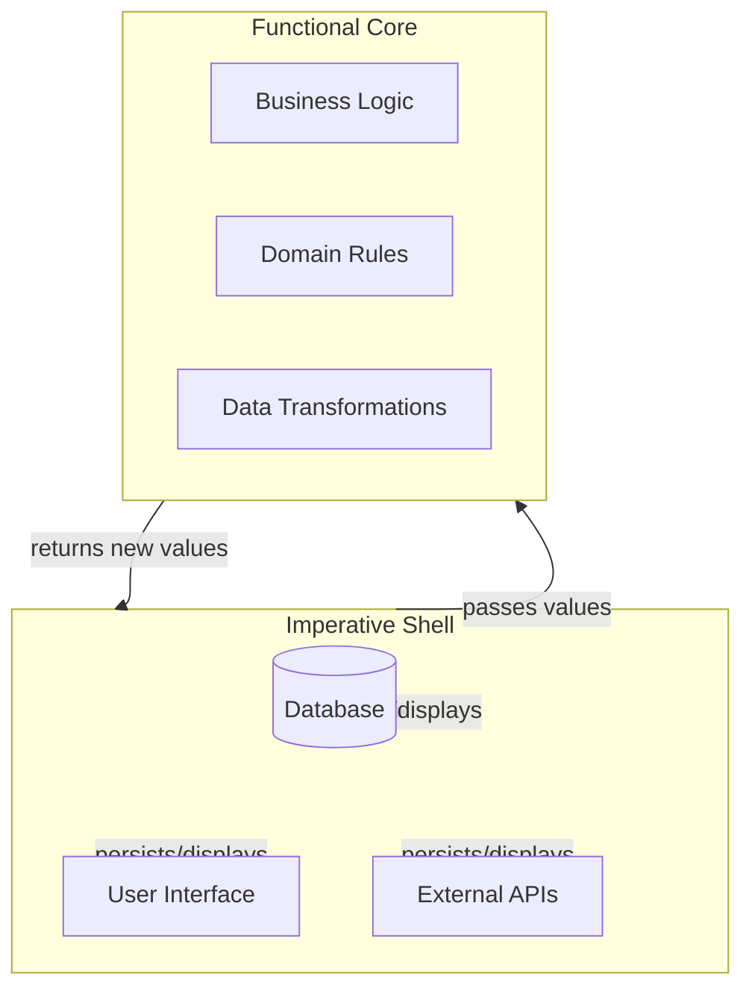

## Summary

The Functional Core, Imperative Shell pattern separates applications into two layers: a **core** containing pure functions for business logic, and a **shell** handling side effects like database access and UI updates. The shell can invoke the core, but the core remains unaware of the shell's existence.

## Architecture

::

## Key Concepts

- **Functional Core:** Pure functions that receive values and return new values. No side effects, no awareness of infrastructure.
- **Imperative Shell:** Handles all infrastructure concerns—databases, UIs, external services. Orchestrates the core by passing values and handling returned results.
- **Dependency Rule:** The shell calls the core; the core never calls the shell. This creates a clean separation.
- **Testability:** Pure functions in the core need only input/output assertions. No mocks required for the bulk of business logic.

## Relationship to Hexagonal Architecture

The pattern shares goals with hexagonal architecture and ports and adapters. Both aim to isolate the application core from external communication details. The functional core pattern emphasizes the programming paradigm (functional vs imperative) rather than the port/adapter metaphor.

## Connections

- [[functional-core-imperative-shell-introduction]] - Lachlan Miller demonstrates this pattern applied to Vue, showing how to refactor a tic-tac-toe game to separate pure functions from reactive state
- [[mastering-vue-3-composables-style-guide]] - Shows how to apply this principle in Vue composables: isolate pure logic from Vue-specific operations
