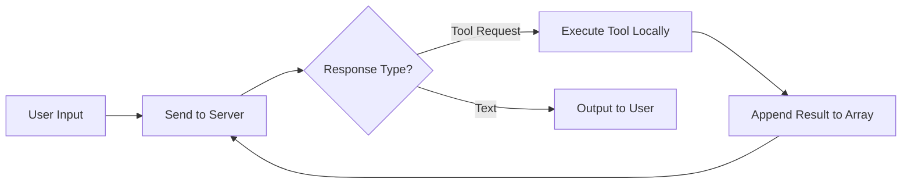

## Key Takeaways

- **The Z80 experiment revealed clean room AI capabilities.** Huntley generated a C application, compiled it, decompiled to assembly, threw away everything but the assembly, then asked an LLM to generate specifications from the assembly alone. From those specs—with no original code—he rebuilt the application for a completely different CPU architecture (Sinclair Z80). The proving point: AI can convert between languages, architectures, and recreate intellectual property from specs.

- **Ralph was born from a nine-year-old's advice.** While playing Factorio with his son, Huntley kept doing the same tasks repeatedly. His son said: "How about you just put it in a loop?" That moment—putting agentic code generation in a loop—created Ralph.

- **Clean room IP recreation is now trivial.** Using the same Intel/AMD clean room technique that gave us competing CPUs, Huntley ran Ralph in reverse mode to generate specifications from HashiCorp Nomad's source code. The 20% gap (enterprise features) was filled by running Ralph over user guides, admin docs, and marketing materials.

- **Software development costs have collapsed.** Running Sonnet in a loop for 24 hours costs roughly $1,042 an hour when divided by 24—cheaper than minimum wage. This changes unit economics for software businesses permanently.

- **The only remaining moat might be infrastructure.** If you can clone a SaaS company's feature set with two people on a beach running Ralph loops, what protects established companies? Huntley suspects infrastructure is the only defensible moat left.

## The Agent Primitives

Every coding agent—Cursor, Windsurf, Claude Code, OpenCode—is roughly 300 lines of code run in a loop. The models do the work, not the harness.

::

The fundamental tools that compose a coding agent:

1. **Read** - Read files from the local filesystem
2. **List** - Show what files exist in directories
3. **Bash** - Execute shell commands
4. **Edit** - Modify file contents

With these four primitives in a loop, you have a full coding agent.

## The New Interview Bar

Huntley now preferences candidates who can:

- Draw the inferencing loop on a whiteboard
- Explain that the server has no memory—it's an array continually appended to
- Define what a tool call is and how it triggers local execution

This knowledge signals curiosity and builder mentality. Candidates who have built an agent have six months to a year of practice advantage over those just picking up the tools.

## The Transformation Timeline

Corporate companies will run 3-4 year transformation programs trying to bend LLMs to their coding standards and proprietary data sets. During that window, model-first startups built by two people can achieve Clayton Christensen-style disruption.

## Notable Quotes

> "My son told me to put it in a loop. He was nine at that stage."

> "Software development is now cheaper than a burger flipper at Mackers. And it can be done whilst you sleep."

> "If you don't know what a tool call is, your career is in jeopardy."

> "Stop fluffing around with the model dropdown selector... The models do all the work, not the harness."

## Connections

- [[some-software-devs-are-ngmi]] - Same author's written argument for why non-adopters will face natural attrition—this video provides the technical backstory and Z80/Ralph origins behind that prediction
- [[deliberate-intentional-practice-with-ai]] - The prescription for building the skills described here: deliberate practice with AI tools outside of work, not just exposure during employment
- [[how-ai-will-change-software-engineering]] - Martin Fowler describes the same industry shift from a different angle—the move from determinism to non-determinism as the most significant change since assembly language
