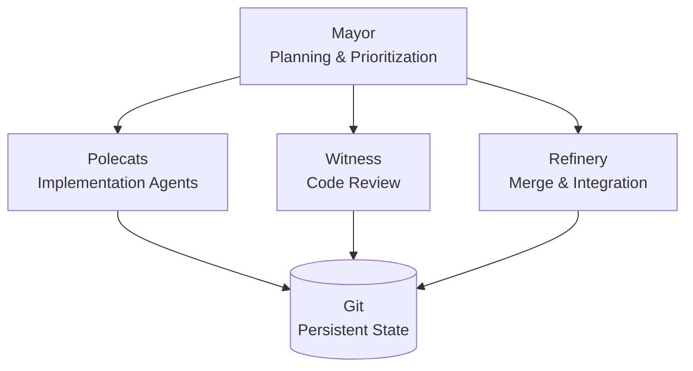

## Summary

Maggie Appleton analyzes Steve Yegge's Gas Town—an agent orchestrator managing dozens of coding agents simultaneously—as speculative design fiction rather than a production-ready tool. Poorly designed in execution, Gas Town nonetheless reveals critical patterns and constraints shaping agentic software development.

## Key Arguments

**Design becomes the bottleneck.** When agents churn through implementation plans at scale, thoughtful architecture and planning constrain progress. Agents cannot determine _what_ should be built, only _how_ to build it.

**Emerging orchestration patterns.** Beneath the chaos lie useful frameworks:

- Hierarchical specialization—agents assume permanent roles (Mayor, Polecats, Witness, Refinery) with clear command structures
- Persistent identity, ephemeral sessions—agent identities and task assignments survive in Git; individual sessions are discardable
- Continuous work streams—systems feed agents perpetual task queues, preventing idleness
- Agent-managed merging—dedicated agents handle conflict resolution and code integration

## Orchestration Model

::

**Economic viability despite high costs.** Gas Town costs $2,000–$5,000 monthly in API expenses—10–30% of a senior developer's annual salary. If such systems achieve 2–3x productivity gains, the cost-benefit analysis becomes defensible.

**The code-distance question.** Yegge claims he never reviews generated code. Rather than a binary choice, context determines appropriate distance: domain complexity, feedback loops, risk tolerance, greenfield vs. legacy, team size, and developer experience all factor in.

## Notable Quote

> "It is 100% vibecoded. I've never seen the code, and I never care to." — Steve Yegge

## Connections

- [[beads]] — Steve Yegge's git-backed issue tracker designed for AI agents; Gas Town uses Beads as its task management layer
- [[tab-tab-dead]] — Another perspective on the paradigm shift: AI agents now write most code, moving the bottleneck from implementation to review
- [[ai-codes-better-than-me-now-what]] — Lee Robinson's observation that coding is no longer the bottleneck aligns with Appleton's analysis; both see design and product thinking as the new constraint
