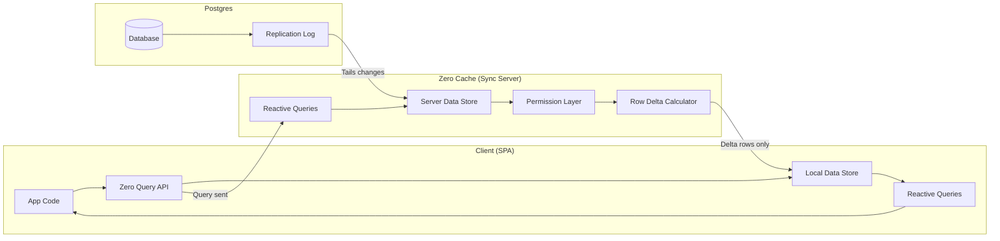
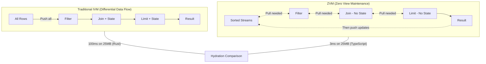

## Overview

Aaron Boodman's second Local-First Conf talk moves from announcement to architecture. Last year he unveiled Zero's query-driven sync concept. This year he opens the hood on _how_ it actually works — and the technical problem that almost killed it: incremental view maintenance at interactive speeds.

The talk is a masterclass in sync engine architecture. It walks through why traditional databases can't handle reactive queries at scale (n-squared reruns), why existing IVM research (differential data flow, DBSP, Materialize) solves the wrong tradeoff (optimized for long-running OLAP queries, not seconds-on-screen UI), and what Zero built instead.

## Query-Driven Sync: How It Actually Works

The core mechanism is deceptively simple. Queries run in **both** places simultaneously — client and server — all the time.

::

The server knows exactly which rows each client has. When a query runs server-side, it calculates the _delta_ — only sending rows the client is missing. Writes don't even need to go through Zero — a raw SQL console change, an LLM writing to the database, anything that triggers the Postgres replication log gets picked up and pushed to affected clients.

The lazy description is "queries start on the client and fall back to the server." But that's not what's happening. Queries run on both sides simultaneously. The client renders immediately with whatever it has, and the server fills in gaps asynchronously. This is why partial navigations feel instant — you get the title immediately from local data while the body streams in.

## Three Problems Query-Driven Sync Solves

### Partial Sync

Developers control what data lives on the client through "preload queries" — no special API, just regular queries designed to warm the cache at app startup. The developer picks the 20% of data covering 80% of needs. Subsequent navigation queries that overlap with preloaded data resolve instantly from the local store.

### Read Permissions

Permissions are just WHERE clauses registered per table. When a client queries `SELECT * FROM documents`, the server silently appends permission filters — ownership checks, group membership, explicit grants. The client runs its query naively, never knowing it only sees a subset. Elegant because it composes with the existing query pipeline instead of being a separate system.

### Fast Page Loads

For public-facing pages (think Notion's published pages), developers can preload just the data for that specific page — no full database download for drive-by visitors. Background queries can progressively warm more data for deeper interactions.

## The IVM Problem

Here's where it gets technically interesting. Why not just use Postgres directly for reactive queries? Because it's an n-squared problem. Sync means keeping tens of megabytes on the client. Queries are large and permission-enriched. Every write by any user invalidates queries for all other users viewing the same data. Traditional query invalidation is both a famous unsolved research problem _and_ useless here — the data is actively being used, so it's always "invalid."

Existing IVM research (differential data flow, DBSP, Materialize) solves this by breaking queries into operator graphs — data pipelines where changes flow through filters, joins, and limits. But these systems optimize for a different tradeoff: they're designed for OLAP queries that run for years, where expensive hydration is amortized over time. Interactive UIs need queries that hydrate in milliseconds and might only live for seconds.

::

## ZVM: Zero's Novel Approach

ZVM (Zero View Maintenance) breaks queries into the same operator graph, but with a critical twist: **pull first, then push.**

Traditional IVM pushes all rows through the pipeline from the start. ZVM starts with sorted input streams and _pulls_ data through the pipeline from the bottom. Because inputs are sorted, operators can stop early — a `LIMIT 10` on a sorted stream only needs to pull 10 rows through the join, not process the entire dataset.

The practical difference is staggering. On 25MB of album data:

- **Differential data flow (Rust):** ~100ms hydration
- **ZVM (TypeScript):** ~3ms hydration, ~1ms for subsequent queries, ~0.5ms for incremental updates

ZVM achieves 33x faster hydration _in a slower language_ because the fundamental approach — pull with sorted data, then transition to push for updates — matches the tradeoff profile of interactive applications. Operators don't need internal state because they can fetch from upstream on demand.

## Notable Quotes

> "The key idea is that when you do a new query that overlaps with a query you've already done, the data is serviced directly from the local device."

> "It isn't really true that queries are running on the client and then falling back to the server. What's really happening is that queries run in both places all the time."

> "I hate Rust. Sorry, any Rust lovers. Can't teach old dogs new tricks."

## Practical Takeaways

- Zero works with existing Postgres — no special database needed. Zero Cache tails the replication log
- Permissions compose as WHERE clauses, not a separate auth layer
- Preload queries are just regular queries run at startup — no framework magic
- ZVM's pull-then-push model trades incremental update speed for dramatically better hydration — the right tradeoff for UI-driven apps
- The `related` keyword replaced joins in Zero's query API since last year's announcement

## Connections

- [[the-big-questions-of-local-first]] — Aaron's concentric circles framework from the panel discussion contextualizes where Zero sits: the pragmatic middle ring where sync-as-UX matters more than ideological data ownership
- [[a-map-of-sync]] — Zero occupies a specific quadrant in Jayakar's taxonomy: medium-size datasets, high update rates, server-authoritative with full offline support
- [[object-sync-engine]] — Zero is Rocicorp's evolution of the object sync engine pattern that Jayakar describes. The architecture (local store + server store + sync protocol) is the same, but query-driven sync refines how data flows between the stores
- [[sync-engines-for-vue-developers]] — This talk fills in the "how" behind Zero's entry in the sync engine comparison. ZVM is the technical innovation that makes query-driven sync performant enough for interactive UI
