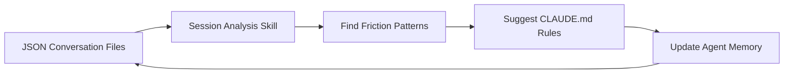

After 800+ hours in Claude Code, Artem Zhutov shares what separates power users from everyone else: feedback loops for self-improvement, deep observability, and treating personal notes as executable context.

## Key Takeaways

- **Analyze your conversations** — All Claude Code sessions are stored as JSON files locally. Build a skill that parses them to find friction points (repeated corrections, ignored instructions) and automatically suggests CLAUDE.md improvements.

- **Verbose output reveals the black box** — Enable verbose output in settings to see exactly what Claude reads, what prompts run, and how the system prompt is structured. Understanding the internals helps you work within the constraints.

- **Most skills go unused** — Having 35 skills means nothing if you only use 5. Curate ruthlessly. Use Obsidian as a dashboard to track skill status (active/archived) and surface forgotten ones.

- **MCP tools waste context** — Loading MCP definitions (Notion, Linear) consumes 14% of your context window before you even start. CLI tools loaded on-demand via skills are more efficient.

- **Notes become executable** — Store goals, tasks, and context in a structured vault. Claude Code transforms static notes into an active system that can read your goals, check your tasks, and execute against your personal context.

- **Session handoffs matter** — When context runs low, don't rely on default compaction. Document current progress in a file Claude can reload in the next session, tagged for easy retrieval.

## Workflow: Session Analysis Feedback Loop

::

## Steps Summary

1. **Enable verbose output** — Settings → search "verbose" → turn on
2. **Build session analysis skill** — Parse local JSON files for friction indicators (keywords like "wrong", "not what I asked")
3. **Set up Obsidian dashboard** — Track skills with status, surface usage patterns via Dataview
4. **Replace MCP with CLI skills** — Load external integrations on-demand rather than upfront
5. **Store personal context** — Goals, tasks, routines in structured markdown for Claude to act on
6. **Create handoff workflow** — When context fills, document progress and tag for next session

## Notable Quotes

> "All of your data, all your conversations is here on your computer and you can use it for improving how you work."

> "English right now is a programming language... the notes aren't static, they're useful context which the agent can act upon."

> "MCP tools fill up 14% of our conversation which we could have spent on interacting with the agent."

## Connections

- [[self-improving-skills-in-claude-code]] — Same feedback loop pattern: capture mistakes in CLAUDE.md to prevent repetition across sessions
- [[obsidian-claude-code-workflows]] — Community patterns for combining Obsidian with Claude Code, including master context files and batch operations
- [[claude-code-skills]] — Official documentation on skills, the mechanism Artem uses to load CLI tools on-demand instead of MCP
