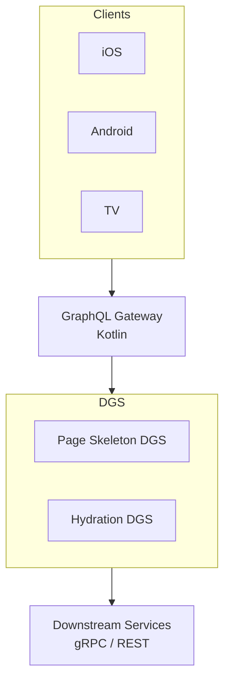

## Overview

Steven Chambers from Netflix's Member API Foundations team walks through two performance optimization journeys that emerged from operating GraphQL at massive scale. The talk reveals how standard library code that seems harmless can cause severe performance issues when multiplied across millions of requests per second.

## Key Arguments

### Netflix operates GraphQL at staggering scale

Netflix runs their GraphQL system at:

- **1 million RPS** at the Domain Graph Service (DGS) layer
- **160 million field executions per second** (resolver invocations)
- **85% of Netflix pages** now served via GraphQL (up from 10-15% five years ago)
- **1,000+ developers** contributing to the codebase

This scale means every edge case becomes just a matter of time.

### Server-driven UI creates unique challenges

Netflix's Discovery Experience Paved Path (DEP) system uses server-driven UI where pages are split into a hierarchy: **Page > Sections > Entities**. The server provides rendering signals (e.g., "carousel section", "billboard treatment") rather than fully rendering content. This creates extremely deep and wide GraphQL query trees due to the explosion of fragments needed for each possible UI signal combination.

### Gateway optimization: Query plan batching

**The problem:** Rolling out server-driven UI to 15 million users caused downstream image service traffic to triple. The gateway was creating 13 separate fetches to the hydration DGS for each unique set of UI signals, even when they could be batched together.

**The fix:** Condensed flatten nodes in the query plan into a single fetch node with aliased queries. This reduced fan-out from 13x to 1x.

**Results:**

- 40% decrease in per-instance RPS
- 4% decrease in per-instance CPU
- 11% decrease in fleet cost

### Subgraph optimization: The GraphQL Java introspection trap

**The problem:** A 4 AM page revealed the service was throttling. Investigation showed 25% of CPU time was spent on garbage collection. The culprit: calling `dataFetchingEnvironment.getSelectionSet().getFields()` - a GraphQL Java introspection API.

**Why it broke at scale:** This API performs a depth-first search through the entire query tree, adding strings to HashSets and HashMaps at every node. With Netflix's deep and wide server-driven UI trees, this created massive memory pressure. All they needed was a single field at depth 3, but the library traversed everything.

**The fix:** Replaced the library call with a custom breadth-first search that stopped at the known depth without allocating unnecessary data structures.

**Results:**

- 40% improvement in JVM allocation rate
- **100% improvement in fleet efficiency** - CPU utilization halved for the same workload

## Architecture Diagram

::

## Notable Quotes

> "At 1 million RPS, every edge case is really just a matter of time. Frameworks and tools have to solve for the generic by definition."
> — Steven Chambers

> "No one would look at this particular introspection API and be like 'Gee, I could go in here and double the efficiency of this DGS and get the promotion I've been looking for.'"
> — Steven Chambers

> "At this scale, resilience is like brushing your teeth. You have to do it every day, otherwise it's going to turn into a snowball that gets too big to manage."
> — Steven Chambers

## Practical Takeaways

- **Profile before optimizing** - The introspection fix was only found through observability tools showing CPU flame graphs and GC pressure
- **Question library assumptions** - GraphQL Java's API wasn't wrong, just wrong for Netflix's specific tree structure and scale
- **Cross-team communication matters** - The gateway fix required data proving the cost increase was directly tied to fan-out before the platform team could prioritize it
- **Pre-mortem your systems** - Ask "If I got paged at 4 AM, do I have the tools and data to debug this?"
- **Batch where possible** - Reducing network calls improves resilience (networks are inherently unreliable) and reduces per-request overhead
