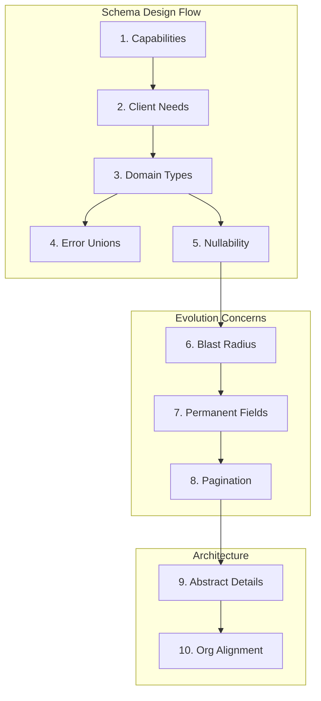

## Summary

A quality GraphQL schema enables clients to fetch exactly the data they need in the fewest requests possible. Drawing from WunderGraph's work with enterprises like eBay, SoundCloud, and Netflix, this article establishes ten principles for designing schemas that remain navigable and support safe evolution.

## The Ten Principles

### 1. Capability-Based Design

Document required capabilities and client workflows before writing schema definitions. Map use cases to understand what needs implementation—the schema emerges from requirements, not databases.

### 2. Client-Centric Design

Structure schemas around consumer requirements rather than backend data models. Prioritize client workflows and usage patterns in architectural decisions.

### 3. Acceptable Duplication (MOIST Principle)

Separate types for different contexts—like `Viewer`, `UserProfile`, and `TeamMember`—provide clarity despite field overlap. This prevents ambiguity about data availability across contexts.

### 4. Explicit Error Handling

Use union and interface types to communicate all possible operation outcomes. This provides type-safe error handling, enabling clients to manage failure scenarios gracefully.

### 5. Nullability and Data Absence

Distinguish between missing data, null values, and null responses from errors. The `@semanticNonNull` directive allows clients to assume fields won't be null except during errors.

### 6. Null Blast Radius

Non-nullable fields that fail propagate nullability upward. Minimize impact by carefully considering where non-null guarantees hold true.

### 7. Permanent Field Assumption

Treat published fields as permanent fixtures. Mobile app usage patterns make deprecation challenging—design assuming perpetual field maintenance.

### 8. Pagination Requirements

Always implement pagination mechanisms using arguments like `first` and `after`. This supports both user experience and enables security-focused rate limiting.

### 9. Abstract Implementation Details

Avoid generating schemas from databases or REST APIs. Design domain-focused APIs that abstract underlying systems, permitting internal evolution without breaking contracts.

### 10. Organizational Alignment

Follow Conway's Law: schema structure should mirror organizational structure. Single-team projects suit monolithic approaches; multi-team environments benefit from federation.

## Visual Model

::

## Key Takeaway

Start with client needs rather than data models. Maintain stable contracts despite backend changes. Respect organizational realities in architectural choices.

## Connections

- [[fixing-graphqls-biggest-mistake-in-512-bytes]] — Deep dive into principle 5 (nullability) with the `@semanticNonNull` directive and graphql-toe library
- [[graphql-performance-issues-at-netflix-scale]] — Real-world consequences when schemas create deep query trees and fan-out patterns (principles 6 and 8)
