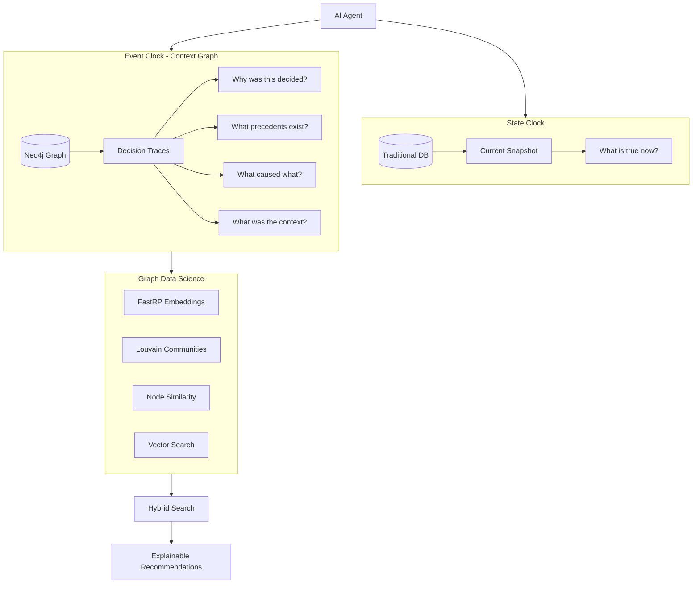

## Summary

Traditional databases are built around a single assumption: what matters is the current state. Your Postgres table knows the customer's credit limit is $50K but can't tell you why, what was considered, or what similar decisions looked like. Lyon calls this the State Clock — a snapshot of current reality.

AI agents break this assumption. When an agent recommends approving a $100K credit line increase, the interesting question isn't whether the answer is right — it's whether you can trace the reasoning. What past decisions informed it? What policies applied? If it goes wrong, what caused it?

This requires the Event Clock: a graph structure that captures decision traces with full context, reasoning, causal chains, and policy applications. Not an audit log (which records actions), but a knowledge graph that captures the _why_ behind every significant decision.

## The Context Graph Data Model

The data model separates entities (what exists) from decision traces (what happened and why):

**Entities:** Person, Account, Transaction, Organization, Policy — the standard business objects.

**Decision Traces:** Decision (core event with reasoning), DecisionContext (state snapshot at decision time), Exception (policy overrides with justification), Escalation (authority chains), Community (clusters of related decisions).

The real power is in the relationships. Causal chains like `(:Decision)-[:CAUSED]->(:Decision)` or precedent links like `(:Decision)-[:PRECEDENT_FOR]->(:Decision)` map naturally to graph edges. In SQL, tracing a causal chain requires recursive CTEs with performance that degrades exponentially by depth. In Neo4j, it's a two-line Cypher query.



::

## Graph Data Science as the Secret Weapon

Three GDS algorithms do the heavy lifting:

- **FastRP Node Embeddings** — Generates 128-dimensional vectors that capture each node's structural position in the graph (not text, but relationship patterns). This enables finding decisions that happened in structurally similar contexts — a fundamentally different kind of similarity than text embeddings alone.
- **Louvain Community Detection** — Automatically clusters decisions that are densely connected through causal and influence relationships. This surfaces patterns like "these 15 trading exceptions all trace back to the same policy gap."
- **Node Similarity for Fraud Detection** — Compares the neighborhood structure of accounts to find ones that behave like known fraud cases. Detects patterns invisible to rule-based systems.

## Hybrid Search: Semantic + Structural

The real trick is combining text embeddings (OpenAI) with graph embeddings (FastRP) for precedent search. A `reasoning_embedding` captures what the decision text says. A `fastrp_embedding` captures where the decision sits in the graph. Together they find decisions that are both semantically similar (similar reasoning) and structurally similar (similar position in the decision network). Neither embedding alone captures the full picture.

## The Demo Workflow

The article walks through a credit limit decision for a customer named Jessica Norris. The AI agent:

1. **Searches** for the customer — pulls risk score, accounts, employer, transactions
2. **Retrieves decision history** — finds a past fraud rejection with velocity check failure, multiple compliance rejections
3. **Finds precedents** — hybrid vector search combining semantic and structural similarity
4. **Looks up policies** — applicable rules like KYC Refresh Policy
5. **Recommends REJECT or ESCALATE** — grounded in specific documented evidence, not a black-box score

31 nodes and 30 relationships visualized. The agent traced the full decision history, understood causal relationships, and made a recommendation grounded in institutional knowledge.

## Why This Matters

The concept comes from Jaya Gupta's thesis that enterprise value is shifting from "systems of record" (Salesforce, SAP) to "systems of agents." The new crown jewel isn't data — it's the context graph: a living record of decision traces where precedent becomes searchable.

Dharmesh Shah offers a reality check — most companies are barely deploying semi-autonomous agents, let alone building context graphs. The vision is sound but the timeline may be optimistic.

What lands for me: the distinction between the State Clock (what's true now) and the Event Clock (what happened, in what order, and with what reasoning) is clean. Every production AI system I've seen struggles with explainability — the model gives an answer but nobody can tell you _why_. Context graphs offer a structural solution: make the "why" a first-class data structure rather than an afterthought.

## Code Snippets

Tracing a causal chain — two lines where SQL would need recursive CTEs:

```cypher
MATCH path = (freeze:Decision {id: $freeze_id})<-[:CAUSED*1..5]-(upstream)
RETURN path
```

FastRP node embeddings to capture structural position:

```cypher
CALL gds.fastRP.mutate('decision-graph', {
  embeddingDimension: 128,
  iterationWeights: [0.0, 1.0, 1.0, 0.8, 0.6],
  mutateProperty: 'fastrp_embedding'
})
```

Louvain community detection for decision clustering:

```cypher
CALL gds.louvain.mutate('decision-graph', {
  nodeLabels: ['Decision'],
  relationshipTypes: ['CAUSED', 'INFLUENCED', 'PRECEDENT_FOR'],
  mutateProperty: 'community_id'
})
```

## Connections

- [[12-factor-agents]] — Both grapple with making AI agent decisions traceable; 12-factor agents argue for owning your context window from the code side, while context graphs capture that context externally as a persistent, queryable structure
- [[agentic-design-patterns]] — The memory and RAG patterns in this book are exactly what context graphs implement at the infrastructure level — persistent decision memory with precedent retrieval
- [[advanced-context-engineering-for-coding-agents]] — Same core thesis from a different angle: AI output quality depends on context quality. Context engineering manages the _input_ to agents; context graphs manage the _output_ trail of agent decisions
