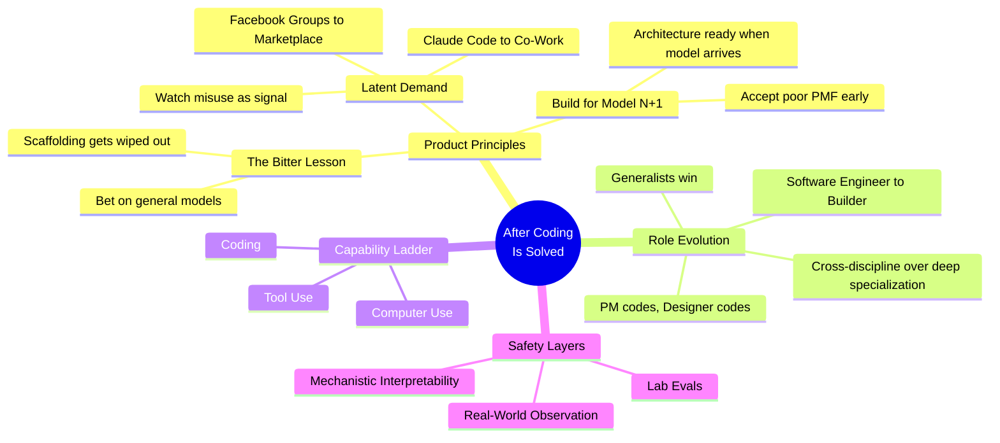

## Timestamps

| Time  | Topic                                                              |
| ----- | ------------------------------------------------------------------ |
| 0:00  | Cold open                                                          |
| 4:00  | Boris's brief move to Cursor and return to Anthropic               |
| 8:00  | Origin story of Claude Code — from two-like hack to platform       |
| 14:00 | Growth: 4% of all GitHub commits, exponential acceleration         |
| 17:00 | 100% AI-written code since November                                |
| 20:00 | Next frontier: Claude generating ideas from feedback and telemetry |
| 22:00 | Coding as "largely solved" — expansion into Co-Work                |
| 25:00 | Latent demand: the Facebook Marketplace analogy                    |
| 30:00 | 200% productivity increase per engineer at Anthropic               |
| 33:00 | Product advice: the bitter lesson, build for model N+1             |
| 38:00 | Printing press analogy — democratization of programming            |
| 42:00 | Role evolution: "builder" replaces "software engineer"             |
| 46:00 | Three layers of AI safety                                          |
| 50:00 | Tips for using Claude Code effectively                             |
| 55:00 | Co-Work usage patterns                                             |
| 58:00 | Lightning round: books, life motto, post-AGI plans                 |

## Key Arguments

### Coding Is Solved (~17:00)

Boris hasn't edited a single line of code by hand since November. 100% written by Claude Code. He ships 10-30 PRs per day. The claim isn't provocative for effect — he means it literally. The remaining challenge is upstream: deciding what to build, reviewing output, and ensuring safety. This maps exactly to what [[shipping-at-inference-speed]] describes — output is bottlenecked by inference time, not developer skill.

### Underfunding Drives Innovation (~30:00)

Put one engineer on a project and give them unlimited tokens rather than staffing up. At Anthropic, productivity per engineer increased 200% — confirming the numbers from [[how-ai-is-transforming-work-at-anthropic]]. The intrinsic motivation to ship fast, combined with AI leverage, outperforms larger teams. Boris frames this as deliberate under-resourcing, not austerity.

### The Bitter Lesson Applied to Product (~33:00)

Borrowing Rich Sutton's principle: always bet on the most general model. Scaffolding and rigid workflows may improve performance 10-20%, but those gains get wiped out with the next model generation. Give the model tools and a goal, let it figure out the execution. This is the anti-pattern to over-engineering your AI workflows — the model will outgrow your guardrails.

### Build for Model N+1 (~33:00)

Design your product architecture for the capabilities the next model will have, not current limitations. Claude Code was built this way: early versions wrote only 20% of Boris's code, but the architecture was ready when Opus arrived. Accept poor product-market fit early in exchange for explosive fit when the model catches up.

### Latent Demand as Product Signal (~25:00)

When users abuse your product for unintended purposes, you've found what to build next. Claude Code users were analyzing genomes, recovering wedding photos, growing tomato plants — from a terminal. This directly led to building Co-Work (see [[first-impressions-of-claude-cowork-anthropics-general-agent]]). The pattern mirrors Facebook Groups being used for buy/sell leading to Marketplace.

### The Printing Press Analogy (~38:00)

Sub-1% literacy in 1450s Europe maps to sub-1% of the population knowing how to code today. The printing press produced more material in 50 years than the prior thousand years. Boris argues AI-generated code is following the same curve. Democratized programming will unlock outcomes as unpredictable as the Renaissance was to 15th-century scribes.

### Generalists Win (~42:00)

The title "software engineer" is starting to disappear, replaced by "builder." On the Claude Code team, the PM codes, the designer codes, the finance person codes. The strongest contributors cross disciplines — product sense, design sense, business acumen all matter more than deep specialization. This extends what Boris described in [[boris-cherny-on-what-grew-his-career-and-building-at-anthropic]] about hiring generalists.

::

## Predictions

- **~20% of all GitHub commits by Claude Code by end of 2025** — Boris endorses the Semi Analysis projection, up from 4% currently
- **Engineers won't need an IDE to code** — the terminal and AI agents replace the traditional editor
- **"Software engineer" title fades** — replaced by "builder" as the default role description
- **Token costs will exceed salary costs** — already emerging at Anthropic, where some engineers spend hundreds of thousands per month on tokens
- **Models will run autonomously for hours or days** — not just minutes as today

## Notable Quotes

> "100% of my code is written by Claude Code. I have not edited a single line by hand since November."
> — Boris Cherny

> "Don't try to box the model in... almost always you get better results if you just give the model tools, give it a goal, and let it figure it out."
> — Boris Cherny

> "The title software engineer is going to start to go away. It's just going to be replaced by builder."
> — Boris Cherny

> "From the very beginning, we bet on building for the model six months from now, not for the model of today."
> — Boris Cherny

## Resources Mentioned

- _Functional Programming in Scala_ by Chiusano & Bjarnason
- _Accelerando_ by Charles Stross
- _The Wandering Earth_ by Liu Cixin
- _A Fire Upon the Deep_ and _A Deepness in the Sky_ by Vernor Vinge
- "The Bitter Lesson" by Rich Sutton — the foundational essay on betting on general methods
- Acquired podcast — Nintendo episode recommended

## Connections

- [[im-boris-and-i-created-claude-code]] — Same author sharing the practical Claude Code workflow tips; this podcast is the strategic vision behind those tactics
- [[boris-cherny-on-what-grew-his-career-and-building-at-anthropic]] — Boris's earlier interview covering the generalist advantage and side-project career strategy that shaped Claude Code's culture
- [[first-impressions-of-claude-cowork-anthropics-general-agent]] — Simon Willison's outside assessment of Co-Work, the product Boris describes emerging from latent demand signals
- [[shipping-at-inference-speed]] — Steinberger independently arrived at the same conclusion: output is bottlenecked by inference, not developer skill
- [[how-ai-is-transforming-work-at-anthropic]] — Anthropic's own internal research confirming the 200% productivity gains Boris cites here
