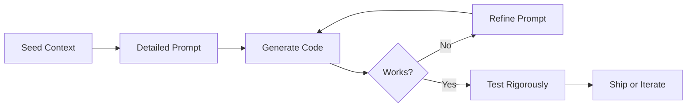

## Summary

LLM-assisted coding is unintuitive and harder than it looks. Success requires treating AI as an "over-confident pair programming assistant" rather than an autonomous developer. The most critical skill is context management: understanding what information the model has access to and strategically building on previous exchanges.

## Key Concepts

### Context Is Everything

The single most important skill for LLM coding is managing conversation context. Each prompt must account for what the model already knows from the current session. Effective users actively build context through deliberate exchanges rather than treating each prompt as isolated.

### Authoritarian Specification

Vague requests produce vague code. Detailed, explicit instructions with function signatures and specific requirements consistently outperform open-ended prompts. Tell the model exactly what you want rather than hoping it intuits your needs.

### Testing Cannot Be Delegated

Every line of generated code requires personal verification. The model will produce plausible-looking code with subtle bugs. Robust test suites become essential infrastructure—they're not optional extras but foundational requirements.

### Iterate Without Shame

Initial outputs rarely reach final form. The workflow is: generate, evaluate, refine through follow-up prompts, repeat. First-draft acceptance is the exception, not the norm.

### Vibe-Coding Builds Intuition

Exploratory "vibe-coding"—prompting without meticulous oversight—helps develop a feel for model capabilities and limitations. This low-stakes experimentation accelerates skill development faster than cautious, measured approaches.

## Workflow Model

Willison's iterative approach to LLM-assisted development:

::

## Practical Techniques

- **Dump existing code first** — Seed context with relevant files before requesting changes
- **Use multiple examples** — Provide 2-3 full examples as inspiration templates
- **Request alternatives** — Ask for different approaches before committing to one
- **Reset when stuck** — Start fresh conversations when context becomes cluttered
- **Tools with code execution** — ChatGPT Code Interpreter, Claude Code, and Claude Artifacts dramatically improve workflow by enabling immediate verification

## Notable Quote

> "LLMs function as over-confident pair programming assistants rather than autonomous developers."

## Connections

- [[simon-willison-on-technical-blogging]] — Same author discusses this article as one of his proudest posts, revealing his approach to comprehensive technical writing
- [[dont-outsource-your-thinking-claude-code]] — Parallel arguments about context hygiene, strategic prompting, and testing as foundation for AI-assisted coding
- [[get-ahead-of-99-percent-of-claude-code-users]] — Extends Willison's context management ideas into systematic feedback loops for continuous improvement
