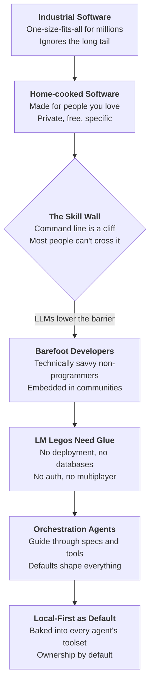

## Overview

Maggie Appleton makes a two-part argument: language models are about to create a golden age of home-cooked software built by "barefoot developers," and the local-first community has a narrow window to become the default infrastructure for this movement — before cloud platforms claim it instead. The talk reframes "local" from a data-sync philosophy into something broader: software built close to home, for the people you know.

This is the talk that connects the dots between the local-first technical movement and the end-user programming dream that's been floating around for 20 years. What makes it compelling isn't just the vision — it's the timing argument. LLMs didn't exist when Clay Shirky proposed situated software in 2004. Now they do, and the defaults baked into AI coding agents will shape millions of decisions about where data lives.

::

## Key Arguments

### Industrial Software Has an Economics Problem

Current software operates at industrial scale: massive teams funded by US venture capital building one-size-fits-all products for millions of users. The economics demand hockey-stick growth, which means every feature decision optimizes for the largest possible audience. This leaves the "long tail" of user needs — specific problems affecting dozens or hundreds of people — permanently out of scope. Google Maps will never show historical boundaries or tidal patterns, no matter how essential those features are to a few hundred specialists.

Maggie pins this to a geographic empathy gap too. Engineers sitting in San Francisco struggle to understand the problems of a homemaker in Tokyo, a street seller in Turkey, or a doctor in Tunisia. So they build software that solves _their_ problems instead — Uber, DoorDash.

### Home-cooked Software Is the Alternative

Robin Sloan's 2020 blog post "An App Can Be a Home-Cooked Meal" named the alternative: small apps built out of care for the people around you, with no commercial ambition. A family video-sharing app. A breastfeeding tracker for a newborn. A custom glucose monitor for a diabetic partner because the default interface wasn't showing critical information. These apps are cheap, private, serve specific needs, and carry no financial pressure to monetize.

The concept stretches back further — Clay Shirky proposed "situated software" in 2004, designed for dozens of users rather than millions. He was 20 years ahead of the technology.

### The Skill Wall Blocks Everyone

The Venn diagram of people who _can_ build home-cooked software and professional developers is a concentric circle. That's the fundamental problem. There's a massive population of technically savvy people — teachers building elaborate Notion spreadsheets, students making over-the-top dashboards, financial planning wonks pushing Excel to its limits — who never cross what Maggie calls "the command line wall." They push low-code tools to their limits but never enter the terminal. Their work stays trapped in cloud subscriptions with monthly fees, far less agency than real developers have.

### Barefoot Developers: The Missing Middle

Inspired by China's barefoot doctors program of the 1960s (where rural villagers received basic medical training and raised life expectancy from 35 to 63), Maggie proposes "barefoot developers" — people embedded in their communities who build software solutions for local problems. Not professional developers, not end users who don't care about programming. The technically curious middle.

These people understand their community's problems intimately. Given the right tools, they could become an unofficial, distributed public service — building software that no industrial company would ever build because there's not enough market value.

### LLM Legos Need Glue

Tools like Vercel's v0 and tldraw's "Make Real" already demonstrate that natural language can generate working interfaces. Maggie demos v0 generating a personal finance dashboard from a text description, and tldraw turning a whiteboard sketch into a working photo booth app with no custom code.

But generating disconnected Lego pieces isn't enough. A barefoot developer can get a pretty UI from v0 but has no idea how to deploy it to a domain, persist data in a database, add user authentication, or enable multiplayer. The glue is missing. Maggie predicts two forms: (1) orchestration agents that guide barefoot developers through technical specifications, and (2) default tool sets these agents are trained to use — databases, deployment pipelines, multiplayer infrastructure.

### Local-First Should Be the Default

Here's the strategic pitch to the conference audience: whatever defaults get baked into these orchestration agents will make millions of decisions for barefoot developers who don't know enough to ask for alternatives. If local-first databases and offline-capable tools aren't in the default toolset, home-cooked software ends up trapped in cloud subscriptions — with changing terms, rising fees, and data you don't own. The nightmare scenario is an explosion of home-cooked software that communities depend on, all held hostage by cloud providers.

## Notable Quotes

> "People need not only to obtain things, they need above all the freedom to make things among which they can live, give shape to them according to their own tastes, and to put them to use in caring for and about others."
> — Ivan Illich, Tools for Conviviality

> "The hottest new programming language is English."
> — Andrej Karpathy (cited by Maggie)

## Practical Takeaways

- Local-first tool builders should design interfaces accessible to barefoot developers _and their AI agents_ — can someone prompt their way into a local-first setup in plain English?
- The local-first and home-cooked software movements share foundational values (user agency, data ownership) but aren't yet coordinated
- Defaults matter more than features when your users don't know what to ask for
- The long tail of user needs is where the real opportunity lives — problems too specific for industrial software but perfect for community-embedded builders

## Connections

- [[local-first-the-secret-master-plan]] — Peter van Hardenberg's companion talk at the same conference. While Maggie argues _who_ will build local software (barefoot developers), Peter argues _how_ with Patchwork's malleable tools. His line about the Bank of America browser extension used by 200 people is exactly Maggie's long-tail argument in miniature
- [[malleable-software]] — Ink & Switch's research agenda for user-adaptable tools is the infrastructure layer that makes Maggie's barefoot developer vision practical. Malleable software is the substrate; barefoot developers are the builders
- [[local-first-software]] — The foundational Ink & Switch essay that defines the technical ideals. Maggie extends "local" beyond data-sync into a broader philosophy: software built close to home, for local people
- [[the-ux-of-local-first]] — Eileen Wagner's talk on the UX gaps that still block mainstream local-first adoption. If barefoot developers are going to use these tools, the UX problems Wagner identifies become even more critical — these users have far less tolerance for rough edges than professional developers
- [[file-over-app]] — Steph Ango's case for files over apps. Maggie's barefoot developers would benefit enormously from file-based tools they actually own, rather than cloud subscriptions that can change terms overnight
