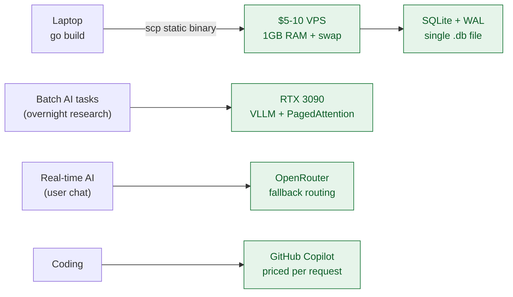

## Core Argument

A pitch-night rejection — _"what do you even need funding for?"_ — is the whole thesis. If your app already has MRR and users, the burn isn't a feature, it's a liability. Steve's stack is a refusal of every 2026 default: no AWS, no Postgres, no Cursor, no token-metered APIs. One VPS, one Go binary, one SQLite file, one graphics card under the desk. Same runway as a seed round, none of the pressure.

## Key Insights

### One VPS, one binary, one file

Rent a $5-10 Linode or DigitalOcean box. 1GB RAM is plenty if you don't waste it on a Python interpreter. Write in Go, compile a statically linked binary on your laptop, `scp` it over, run it. No Docker, no Kubernetes, no `pip install`, no virtualenv. When something breaks at 2am you know exactly where the logs are and exactly which process to restart. The whole "where does it run" question collapses into one box.

### SQLite is the database, not a stepping stone

The enterprise reflex — "spin up Postgres on RDS" — assumes you'll outgrow SQLite. Steve's counter: a local SQLite file over the C-interface is orders of magnitude faster than a TCP hop to a managed database, and with WAL mode (`PRAGMA journal_mode=WAL; PRAGMA synchronous=NORMAL;`) readers don't block writers and writers don't block readers. Thousands of concurrent users on an NVMe. The migration you're pre-optimizing for probably never comes.

### The AI stack splits on latency, not capability

Two lanes, not one. Long-running batch work (summarizing thousands of earnings reports) goes to a $900 RTX 3090 off Facebook Marketplace running VLLM — upfront cost, infinite credits, no API-bill surprise when you find a prompt bug on iteration 7. Low-latency user-facing chat goes to OpenRouter with one OpenAI-compatible call that fails over between Anthropic, OpenAI, and Google automatically. The cloud is for the millisecond-sensitive path only.

### The Copilot pricing arbitrage

Everyone is sprinting to spend hundreds a month on Cursor and Claude API keys. Meanwhile Copilot charges per _request_ — a chat message — not per token. Tell the agent "keep going until every test passes," hit enter, go make coffee. Thirty minutes of autonomous codebase-wide work costs about $0.04. Steve runs Claude Opus 4.6 all day on a ~$60/mo bill. The pricing model is the product; the IDE is beside the point.

### Local AI has an upgrade ladder

Ollama for exploration (one command, dozens of models). VLLM for production (drops Ollama's concurrency ceiling — send 16 async requests, PagedAttention batches them so all 16 finish in roughly the time of one). Transformer Lab if you actually need to fine-tune. Each step solves a specific bottleneck of the previous one; nobody needs to jump straight to the hard thing.

### Lean is an architecture, not a phase

The throughline: every choice here makes the system _smaller_, not just cheaper. Single binary, single file, single box, single `scp`. That simplicity _is_ the moat — you can reason about the whole system in your head, which is how one person ships as much as a funded team.

## Alexander's Perspective

This is the bootstrapper's answer to [[your-startup-idea-is-their-weekend-holiday]]. If AI makes SaaS trivially replaceable, then your cost structure is the only runway you control — and Steve's playbook is the extreme version: zero burn, one person, ship-whatever-forever.

The Copilot trick is the genuinely non-obvious insight for me. I've been watching the Cursor/Claude-API subscription arms race with discomfort. Pricing per _request_ rather than per _token_ flips the incentive — it rewards exactly the "write one brutally detailed prompt, let the agent loop for 30 minutes" pattern I already prefer. That's an arbitrage worth testing.

The SQLite + Go argument pairs with [[dhh-on-programming-rails-ai-and-productivity]]: both argue the "enterprise" default stack is a cultural tax, not a technical requirement. DHH goes after the JavaScript toolchain; Steve goes after AWS, Postgres, and token-metered AI. Same refusal, different targets.

Where it gets uncomfortable: the stack is fantastic for _one developer who trusts themselves_. Harder to sell to a team where "but what about HA, auditing, RBAC, backups, on-call..." will come up in the first standup. Worth sitting with that tension before adopting it wholesale.

## Connections

- [[your-startup-idea-is-their-weekend-holiday]] — Andreas Klinger's "SaaS is a weekend project" thesis; Steve's reply is that cost discipline is the new moat when the code is free.
- [[dhh-on-programming-rails-ai-and-productivity]] — Same anti-enterprise, ship-simple philosophy. DHH fights build tools; Steve fights AWS and token billing.
- [[sqlite-persistence-on-the-web]] — Different context (SQLite in the browser, not on the server) but shares the same "SQLite is production-ready if you understand the primitives" conviction.
- [[deep-and-shallow-modules]] — A statically-linked Go binary over `scp` is a deep module: tiny interface, huge functionality hidden behind it. Kubernetes is the shallow version.
