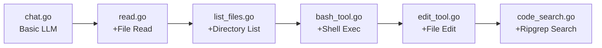

## Overview

This repository accompanies Geoffrey Huntley's workshop on building coding agents from scratch. The code demonstrates that functional coding assistants require nothing exotic - just Go, the Anthropic API, and five core tools composed in an event loop.

## Key Features

- **Incremental build structure** - Six progressive files, each adding one capability
- **Minimal dependencies** - Uses only Go standard library and Anthropic SDK
- **Complete tool implementations** - Read, list, bash, edit, and ripgrep-based search
- **Event loop architecture** - The "agent heartbeat" pattern that powers all coding assistants

## Progressive Build Structure

The workshop builds capability layer by layer:



::

## Code Snippets

### Installation

```bash
# Clone and set up
git clone https://github.com/ghuntley/how-to-build-a-coding-agent
cd how-to-build-a-coding-agent

# Set your Anthropic API key
export ANTHROPIC_API_KEY=your-key-here
```

### Running Each Stage

```bash
# Start with basic chat
go run chat.go

# Progress through stages
go run read.go
go run list_files.go
go run bash_tool.go
go run edit_tool.go
go run code_search_tool.go
```

## Technical Details

Tools function as plugins defined by three components: name, input schema (generated from Go structs), and execution function. The agent loop follows a consistent pattern:

1. Accept user input
2. Send to Claude
3. Check for tool calls
4. Execute requested tools
5. Return results to context
6. Repeat until complete

## Connections

- [[how-to-build-a-coding-agent]] - The workshop article that explains the concepts this code implements
- [[building-effective-agents]] - Anthropic's guide reinforcing the same "simplicity first" philosophy demonstrated here
