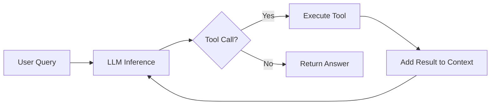

Building a functional coding agent requires nothing more than 300 lines of code running in a loop with LLM tokens. The mystique around AI agents evaporates once you understand the five core primitives that power them.

## The Agent Loop

Every coding agent follows the same fundamental pattern: receive a query, perform LLM inference, check for tool calls, execute tools, allocate results back to context, and repeat.

::

## Five Core Primitives

Any coding agent needs exactly five tools to operate effectively:

1. **Read** - Load file contents into context
2. **List** - Enumerate files and directories
3. **Bash** - Execute shell commands
4. **Edit** - Apply modifications to files
5. **Search** - Use ripgrep for code pattern discovery

These primitives compose into complex behaviors. The agent decides which tool to invoke, the system executes it, and results feed back into the context window for the next iteration.

## Model Selection

Not all LLMs suit agentic tasks equally. Claude Sonnet excels because Anthropic trained it to prioritize tool-calling over extended reasoning. When building agents, choose models optimized for structured tool use rather than raw conversational ability.

## Context Window Management

Context windows are limited resources requiring careful allocation. Performance degrades as you pack more information into the window. Key strategies:

- Clear context after each task completion
- Avoid installing excessive MCP servers
- Treat token allocation like managing limited memory

The more you allocate to a context window, the worse its performance becomes.

## Career Implications

Agent-building skills are becoming baseline professional competencies. Companies like Canva explicitly allow AI use in interviews, signaling industry-wide expectations. The threat isn't AI taking jobs - it's colleagues who understand AI automation taking yours.

## Connections

- [[building-effective-agents]] - Anthropic's complementary guide that emphasizes the same "simplicity first" philosophy and outlines workflow patterns for orchestrating agents
- [[agentic-design-patterns]] - Expands on these primitives with 21 design patterns for production agents, covering memory, routing, and multi-agent collaboration
