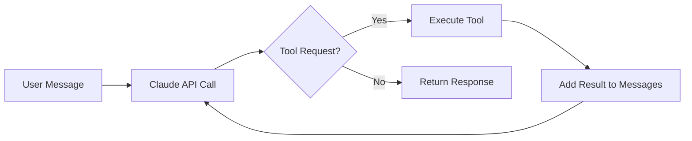

## Summary

Thorsten Ball demystifies AI agent development by walking through a minimal Go implementation. The core insight: sophisticated agent behavior emerges from surprisingly simple components. An LLM with tool definitions, a loop to handle tool calls, and enough tokens. The real challenge is "elbow grease"—practical engineering work, not architectural complexity.

## Key Concepts

### The Tool-Use Pattern

Every agent implementation follows the same structure:

1. Define tools the model can use (name, description, JSON schema)
2. Send messages to the LLM
3. Check if the response requests a tool call
4. Execute the tool, return results
5. Loop until the model produces a final answer

### The Three Essential Tools

Ball implements a working agent with just three tools:

- **read_file** - Reads file contents given a path
- **list_files** - Lists directory contents
- **edit_file** - Modifies files via string replacement

Each tool needs only a name, description, input schema, and execution function.

## Visual Model



::

## Code Snippets

### Tool Definition Pattern

How tools are defined for Claude.

```go
tools := []anthropic.ToolParam{
  {
    Name:        anthropic.F("read_file"),
    Description: anthropic.F("Read file contents"),
    InputSchema: anthropic.F(interface{}(map[string]interface{}{
      "type": "object",
      "properties": map[string]interface{}{
        "path": map[string]string{"type": "string"},
      },
    })),
  },
}
```

### The Agent Loop

Core loop that powers the agent.

```go
for {
  response, _ := client.Messages.New(ctx, params)

  if response.StopReason == "end_turn" {
    break // Model finished
  }

  // Execute tool calls and add results to messages
  for _, block := range response.Content {
    if block.Type == "tool_use" {
      result := executeTool(block.Name, block.Input)
      messages = append(messages, toolResultMessage(result))
    }
  }
}
```

## Practical Takeaways

- The model does the heavy lifting—tooling is infrastructure
- Start with basic primitives before adding complexity
- Claude decides when and how to use tools based on descriptions
- Multi-step reasoning emerges naturally from the loop pattern

## Connections

- [[building-effective-agents]] - Anthropic's official guide reinforces this "simplicity first" philosophy, providing complementary workflow patterns for production deployments
- [[how-to-build-a-coding-agent]] - Geoffrey Huntley's parallel take on the same topic, arriving at the same "300 lines of code" conclusion independently
