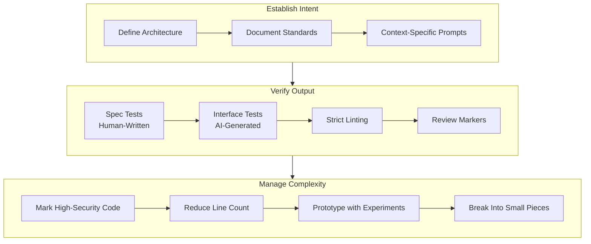

## Summary

Heidenstedt lays out 12 principles for maintaining quality when AI generates your code. The core argument: every architectural decision you don't make and document gets made by the AI instead—often badly. Developers must function as architects and verifiers, not prompt-writers. The principles span three layers: establishing intent upfront, building automated verification, and managing complexity through experimentation.

## AI Governance Model

::

## Key Principles

### Establish Intent Before AI Touches Code

Every undocumented decision becomes an AI decision. Heidenstedt argues developers must lock in architecture, coding standards, design patterns, and constraints in repository-level documentation before prompting. Context-specific instruction files (like `CLAUDE.md`) reduce per-task setup and keep the AI aligned with project conventions.

### Build Layered Verification

A single test suite isn't enough. Heidenstedt distinguishes between **specification tests** (human-written, property-based, locked from AI modification) and **interface tests** (AI-generated with minimal implementation knowledge). Specification tests prevent the AI from gaming results through hardcoded values or over-mocking. Interface tests catch regressions without being adapted to match flawed code.

### Mark What Needs Human Eyes

Not all AI-generated code needs the same scrutiny. Review markers (`//A` for unreviewed, `//HIGH-RISK-UNREVIEWED` for security-critical) create a triage system. Authentication, authorization, and data handling functions get flagged for mandatory human comprehension before approval.

### Reduce Surface Area

Each line of code consumes context window space and increases failure probability. Heidenstedt treats minimizing code as a quality strategy: smaller codebases leave more room for AI reasoning and reduce the verification burden.

### Prototype Before Committing

AI makes exploration cheap. Run multiple solution prototypes before picking one. The cost of a bad experiment is low; the cost of committing to the wrong approach early compounds over time.

## Connections

- [[ai-is-a-high-pass-filter-for-software]] - Finster's amplification thesis explains why Heidenstedt's principles matter: developers with strong verification foundations get compounding returns from AI, while those without see problems compound faster
- [[the-way-to-deliver-fast-with-ai-quality]] - Tsvetanov reaches the same conclusion from the testing side: quality infrastructure (strict types, mutation testing, clean APIs) enables fast AI-assisted delivery
- [[essential-ai-coding-feedback-loops-for-typescript-projects]] - Pocock's three feedback loops (TypeScript, Vitest, Husky) are a concrete implementation of Heidenstedt's layered verification principle
- [[spec-driven-development-with-ai]] - Spec Kit formalizes the "establish intent first" layer into a four-phase workflow that separates stable intent from flexible implementation
