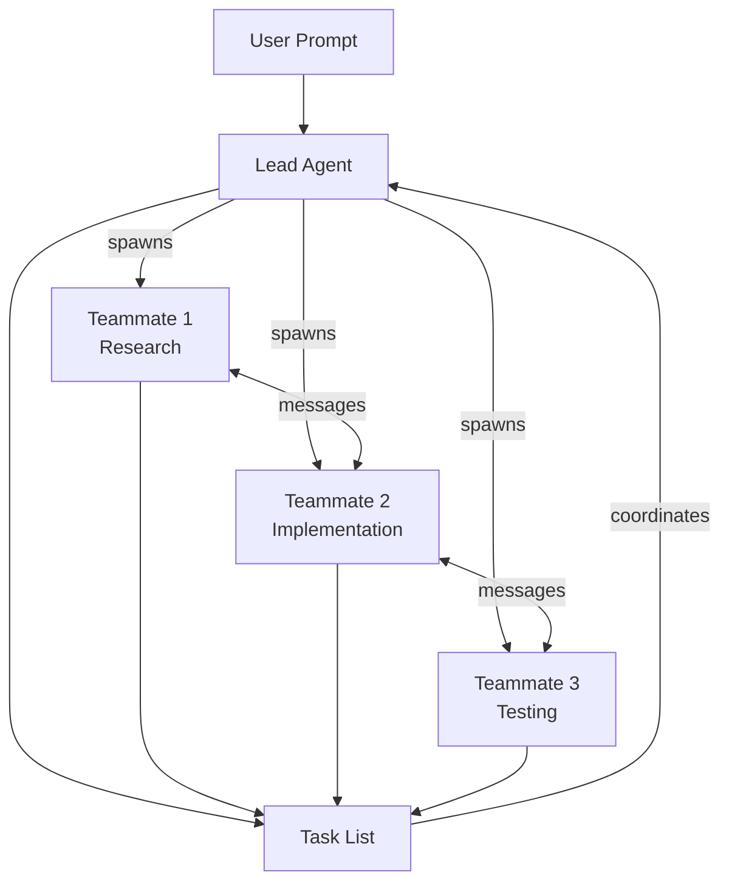

## Summary

Anthropic shipped native agent teams into Claude Code, a feature the OpenClaw community had already built via custom skills. Instead of one agent grinding through tasks sequentially, a lead agent breaks work into pieces and spins up independent teammates that work in parallel, coordinate through a shared task list, and message each other directly.

## Key Points

- **Sub-agents vs. agent teams:** Sub-agents report results back to a single parent. Agent teams are fully independent sessions with their own context windows that communicate peer-to-peer, not just up the chain.
- **Enable with one setting:** Add `CLAUDE_CODE_EXPERIMENTAL_AGENT_TEAMS: "1"` to `settings.json` under `env`, or set it as a shell environment variable.
- **Delegate mode locks the lead into coordination:** Press `Shift+Tab` to prevent the lead from doing work itself—forces it to only spawn, assign, and manage teammates.
- **Sweet spots for teams:** parallel research, competing debugging hypotheses, cross-layer work (frontend + backend + tests), and feature modules that touch separate files.
- **When to skip teams:** sequential tasks where step two depends on step one, same-file edits that cause overwrites, and simple tasks where coordination overhead outweighs benefit.
- **Display modes:** In-process (default, `Shift+Up/Down` to switch teammates) or split-pane (requires tmux or iTerm2).
- **Known limitations:** session resumption breaks in-process teammates, task status can lag, one team per session, and split-pane mode doesn't work in VS Code terminal or Ghostty.

## Diagram

::

## Best Practices

- Give teammates detailed spawn prompts—they don't inherit the lead's conversation history, only project context from CLAUDE.md and MCP servers.
- Size tasks as self-contained units that produce a clear deliverable: a function, a test file, a review.
- Keep each teammate on different files to avoid overwrite conflicts.
- Start with research and review tasks before jumping into parallel implementation.
- Check in on the team regularly to catch unproductive paths early.

## Connections

- [[anthropic-just-dropped-agent-swarms]] - Covers the same feature from a different angle, focusing on shared task lists, dependency blocking, and devil's advocate patterns
- [[understanding-claude-code-full-stack-mcp-skills-subagents-hooks]] - Provides the broader context of Claude Code's extensibility layers where agent teams sit alongside MCP, skills, and subagents
- [[claude-codes-new-task-system-explained]] - The task system with dependency tracking that agent teams build on for coordination
- [[agentic-design-patterns]] - Theoretical foundation for multi-agent collaboration patterns like hierarchical planning and specialized roles
- [[welcome-to-gas-town]] - Steve Yegge's industrial-scale framework for managing 20-30 parallel agents with hierarchical roles, the vision that agent teams now make accessible out of the box
