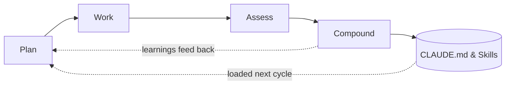

Kieran Klaassen walks through a 50-minute live demo of [[compound-engineering-plugin]], his open-source plugin for Claude Code that structures AI-assisted development into a repeatable loop. The core idea: engineering work should make future work easier, not harder.

## The Compound Engineering Loop

Every development cycle follows four steps:

1. **Plan** — Research-heavy phase with parallel sub-agents (code analyzer, best practices researcher, framework researcher) grounding the plan in the existing codebase
2. **Work** — Execute the plan in a fresh context to avoid polluting implementation with planning artifacts
3. **Assess** — Multi-perspective reviews from specialized agents (security, architecture, simplicity, DHH-style critique)
4. **Compound** — Codify learnings into CLAUDE.md, docs, or skill files so the next cycle starts smarter

::

## Key Takeaways

- **Planning gets 80% of the investment.** The plugin spawns three parallel sub-agents during planning, then runs a "spec flow analyzer" that simulates user personas walking through the plan to catch gaps before implementation begins.
- **Fresh context matters.** The `work` phase starts a new session so implementation isn't cluttered with research artifacts from planning. The plan document bridges the two phases.
- **Playwright + Opus 4.5 closes the QA gap.** The model controls Chrome, takes screenshots, reads console logs, and fixes bugs in a tight loop — functioning as an autonomous QA team.
- **The LFG command chains everything.** A single slash command runs the entire loop end-to-end: plan, work, test via Playwright, multi-perspective review, triage, resolve, generate feature video, and create a PR.

## Slash Commands, Sub-Agents, and Skills

Kieran draws a clear distinction between the three extension mechanisms in [[claude-code-skills]]:

| Mechanism          | When to Use                                                        |
| ------------------ | ------------------------------------------------------------------ |
| **Slash commands** | User-triggered actions — the "business logic" of your workflow     |
| **Sub-agents**     | Parallel or isolated work with a focused result (research, review) |
| **Skills**         | Just-in-time context documents loaded only when relevant           |

## The Minimum Viable Version

For developers who don't want the full plugin system, Kieran's advice is dead simple: when Claude makes a mistake, tell it to add the lesson to CLAUDE.md. Since CLAUDE.md loads into every prompt, this creates a persistent learning loop with zero infrastructure.

## Notable Quotes

> "If you invest time to have the AI learn what you like and learn what it does wrong, it won't do it the next time. So that's the seed for compound engineering."

> "The skills you need are tech lead skills and management skills, because you're managing these agents."

## Connections

- [[compound-engineering-plugin]] — The exact plugin demonstrated in this tutorial, with the four-step loop and slash commands
- [[claude-tasks-beads-compound-engineering-convergence]] — Same author exploring how Claude Code's native task system fits into the compound engineering workflow
- [[claude-code-skills]] — Skills are a core extension mechanism discussed here, loaded just-in-time to avoid context bloat
- [[from-tasks-to-swarms-agent-teams-in-claude-code]] — The sub-agent patterns Kieran uses (parallel research agents, multi-perspective review) connect to the broader agent teams architecture
