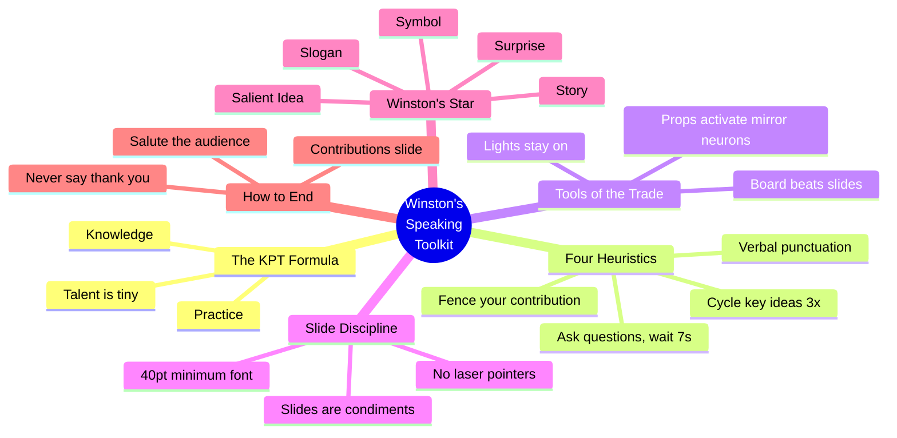

## Overview

Patrick Winston taught this lecture every January at MIT for over 40 years. It's not a TED-style motivational talk — it's a systems thinker's breakdown of what makes communication work, delivered by someone who spent decades iterating on the craft. Winston died in 2019, making this recording the definitive version.

The core thesis is disarmingly simple: speaking well is a skill, not a talent. The formula is `Quality = Knowledge × Practice + T`, where T (talent) is vanishingly small. Everything that follows is the knowledge component.

## Key Arguments

### Communication Determines Success More Than Ideas

Winston opens with a bold ordering: your success depends on your ability to speak, your ability to write, and the quality of your ideas — in that order. Most people assume ideas are paramount. Winston argues the packaging determines whether anyone ever encounters the ideas at all.

> "Your success in life will be determined largely by your ability to speak, your ability to write, and the quality of your ideas, in that order."
> — Patrick Winston

### The KPT Formula

Communication quality follows a simple equation: Knowledge × Practice × Talent. The critical insight is that T is tiny. Winston illustrates this with a story about Olympic gymnast Mary Lou Retton skiing at Sun Valley — she was a superior athlete but a worse skier because she lacked the knowledge and practice he had accumulated on the slopes.

This reframes speaking from "you either have it or you don't" to "you just haven't learned the techniques yet."

### Four Heuristics for Holding Attention

Winston identifies four techniques that any speaker should use throughout a talk:

1. **Cycle** — Cover core ideas at least three times in different ways. At any moment, roughly 20% of the audience is mentally absent. Cycling ensures everyone catches the key points even if they fog out.

2. **Fence** — Explicitly distinguish your idea from adjacent ideas. "My algorithm is linear; Jones's is exponential." Without fencing, audiences conflate your work with everything else in the space.

3. **Verbal punctuation** — Enumerate sections aloud ("This is the third of four ideas...") so that fogged-out listeners have re-entry points. It's the oral equivalent of paragraph breaks.

4. **Ask questions** — Pose questions and wait a full seven seconds for answers. The question must be neither too obvious (embarrassing) nor too hard (unanswerable).

> "At any given moment, about 20% of you will be fogged out no matter what the lecture is. So if you want to ensure that the probability that everybody gets it is high, you need to say it three times."
> — Patrick Winston

### Boards Beat Slides for Teaching

The blackboard matches the speed at which humans absorb ideas — you write at roughly the pace people can think. Slides are appropriate for conferences where you're _exposing_ ideas, not _teaching_ them. The problem with text-heavy slides is biological: humans have a single language processor. When someone reads slide text, they stop hearing the speaker. You can't do both simultaneously.

> "You want the slides to be condiments to what you're saying, not the main event or the opposite way around."
> — Patrick Winston

### Props and Mirror Neurons

Physical demonstrations activate mirror neurons — the audience literally feels themselves doing the action. No slide achieves this. Winston claims props are what audiences remember years later when everything else has faded. Surveys consistently show students prefer chalk and props over PowerPoint.

### Winston's Star: Five Elements of Being Remembered

Work that gets recognized tends to have five elements — Winston calls this the "star":

1. **Symbol** — a visual or conceptual icon
2. **Slogan** — a short, memorable phrase that gives it a handle
3. **Surprise** — a counterintuitive result
4. **Salient idea** — one element that stands above the rest (not the most important, the most distinctive)
5. **Story** — the narrative of how you did it and why it matters

Winston's own PhD thesis on arch-learning became well-known precisely because it accidentally contained all five elements.

::

### How to End a Talk

Winston is emphatic: never end with "thank you." It implies the audience stayed out of politeness and would have preferred to be somewhere else. Instead, end with a joke (the audience is now calibrated), a benediction, or a direct salute to the audience. The final slide should always be "Contributions" — not questions, not collaborators, not conclusions. It tells people what you actually accomplished while they file out.

> "When you say thank you, even worse, thank you for listening, it suggests that everybody has stayed that long out of politeness and that they had a profound desire to be somewhere else."
> — Patrick Winston

## Practical Techniques

- **Start with an empowerment promise**, not a joke — audiences need time to calibrate to your voice before they can process humor
- **Keep lights on** — dim rooms signal sleep; always ask AV staff for full lighting
- **Room should be half full minimum** — if it won't be, get a smaller room
- **Best lecture time: ~11 AM** — awake, not post-meal, not fatigued
- **Case the room beforehand** — visit before the talk to neutralize surprises
- **Minimum font size: ~40pt** — if you need smaller, you have too many words
- **No laser pointers** — they force you to turn away and lose eye contact; use on-slide arrows
- **Practice with people who don't know your work** — knowledgeable reviewers hallucinate material that isn't there

## Notable Quotes

> "Your ideas are like your children. And you don't want them to go into the world in rags."
> — Patrick Winston

> "It's extremely hard to see slides through closed eyelids."
> — Patrick Winston

## Connections

- [[simon-willison-on-technical-blogging]] — Both argue that packaging ideas matters as much as the ideas themselves. Winston makes this case for speaking, Willison for writing — two sides of the same coin
