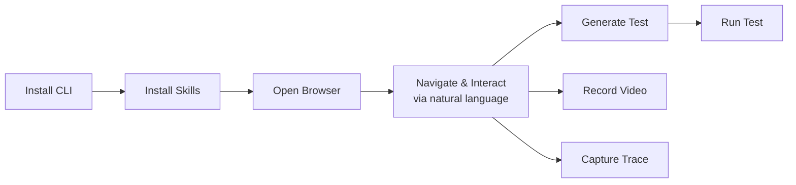

## Key Takeaways

- **Playwright CLI installs as agent skills.** Running `playwright-cli install-skills` drops skill files and reference docs into a local folder (`.claude/` or `.goose/`), giving the agent structured knowledge about every CLI capability.
- **Snapshots stay on disk, not in context.** The accessibility tree for each page gets saved as a local YAML file with element refs. The agent reads only what it needs, avoiding the token bloat of MCP's approach.
- **Natural language drives the browser.** Telling the agent "go to the videos page and filter for MCP" triggers the right CLI commands — no Playwright API knowledge required.
- **Test generation works from interaction history.** After navigating and clicking through a site, the agent generates a full Playwright TypeScript test based on the actions it performed.
- **Video recording and tracing come built-in.** The CLI captures browser sessions as video files and Playwright traces, making it easy to verify what the agent actually did.

## Code Snippets

### Install Playwright CLI Skills

Sets up skill files and reference docs for the agent.

```bash
# Install Playwright CLI globally
npm install -g playwright-cli

# Install skills into your agent workspace
playwright-cli install-skills
```

### Generated Test Example

The agent produced this test after navigating to a site and filtering videos by tag.

```typescript
import { test, expect } from "@playwright/test";

test("navigate to videos and filter by MCP", async ({ page }) => {
  await page.goto("https://debbie.codes");
  await expect(page).toHaveTitle(/Debbie/);
  await page.getByRole("link", { name: "Videos" }).click();
  await expect(page).toHaveURL(/videos/);
  await page.getByRole("button", { name: "MCP" }).first().click();
  await expect(page.getByRole("heading", { level: 1 })).toContainText("MCP");
});
```

> Reconstructed from spoken code—verify against video

## Workflow



::

## Connections

- [[playwright-cli-vs-mcp]] - Explains the architecture behind this demo: CLI writes browser data to disk instead of piping it into the LLM context, saving 4x tokens
- [[introducing-agent-skills-in-vs-code]] - The skill files Playwright CLI installs follow the same portable agent skills pattern described here
