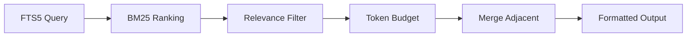

## Summary

Context7 slashed its free tier from roughly 6,000 to 1,000 monthly requests, forcing Simantov to rethink the model entirely. His insight: documentation indexing is expensive once, then cheap forever. Clone a repo, chunk the markdown, build a SQLite FTS5 index, and distribute the resulting `.db` file. Every query after that runs locally in under 10ms with zero network dependency.

## Key Concepts

- **Index once, query forever** — The expensive work (cloning, parsing, chunking) happens a single time per library version. After that, queries hit a local SQLite database with FTS5 full-text search. No per-query costs, no rate limits.
- **Portable `.db` distribution** — Pre-built databases can be shared across teams or committed to repos. The author compares this to compiled binaries vs. interpreted scripts: front-load the work, then distribute the result.
- **BM25 ranking with token budgets** — The search pipeline uses FTS5's Porter stemmer and BM25 relevance scoring, then applies a token budget to keep responses within LLM context limits. Adjacent chunks merge to preserve continuity.
- **Chunking strategy** — Documents split at H2 headings into ~800 token chunks (max 1,200). Oversized sections break at code block boundaries first. Content hashing deduplicates identical chunks across versions.
- **MCP as the interface layer** — The tool exposes an MCP server that any compatible client (Claude Desktop, Cursor, VS Code Copilot, Windsurf, Zed) can consume. One indexing pipeline, many consumers.

## Search Pipeline



::

## Code Snippets

### Installation and indexing

Add library documentation and serve it as an MCP endpoint.

```bash
npm install -g @neuledge/context
context add https://github.com/vercel/next.js
context add https://github.com/vercel/ai
claude mcp add context -- context serve
```

## Connections

- [[local-first-software]] — The foundational essay defining the paradigm this tool embodies: data lives on user devices, servers play a supporting role, and ownership stays with the developer
- [[what-is-local-first-web-development]] — Both apply local-first principles to practical developer workflows, though this article targets AI documentation access rather than web application data
